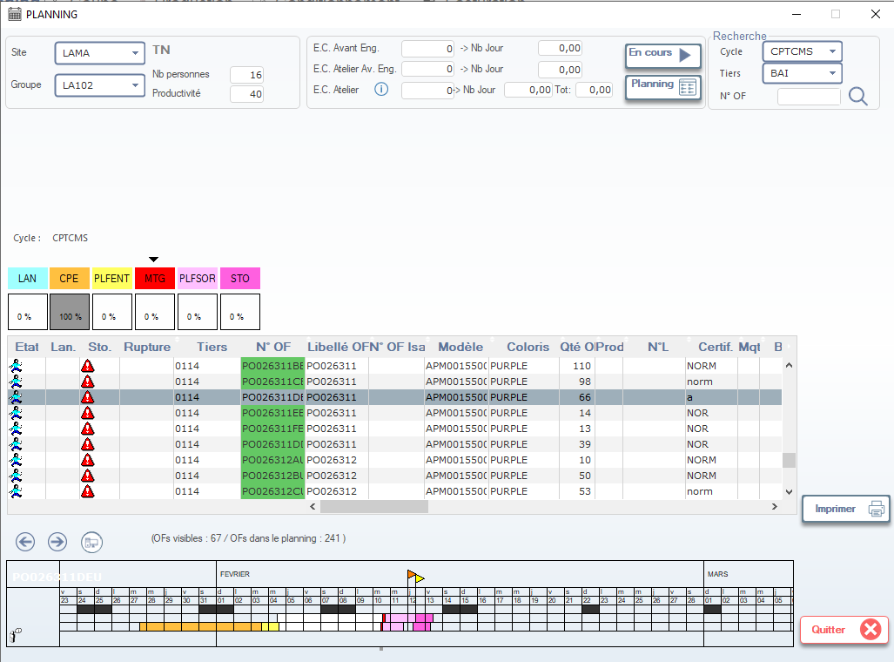

# Planning des Lignes de Couture

Cette fenêtre permet de planifier et suivre la charge de travail des lignes de couture (internes ou externes), en fonction des ordres de fabrication (OF) à produire. Elle affiche les délais, les priorités, et surtout l’état d’avancement des pièces coupées vers les ateliers de confection.

> ⚠️ **Remarque** : Ce planning est utilisé pour piloter la production interne **et** le suivi des sous-traitants (ex: ateliers de couture externes). Les données sont mises à jour automatiquement via les bons de livraison de coupe.

---

## 1. En-tête de configuration

### Site
- Sélectionnez le site de production (ex: `LAMA`).

### Groupe
- Choisissez le groupe de lignes (ex: `LA102`) ou le code du **fabricant de couture** si externe.

### Nb personnes / Productivité
- **Nb personnes** : Nombre d’opérateurs affectés (si ligne interne).
- **Productivité** : Rendement moyen en % ou unités/heure (ex: `40`).

> 💡 Pour les sous-traitants, ces champs peuvent être masqués ou fixés par contrat.

---

## 2. Indicateurs de performance

Affichent les écarts entre la planification et la réalité :

| Champ                 | Description |
|-----------------------|-------------|
| **E.C. Avant Eng.**   | Écart avant engagement (en jours). |
| **E.C. Atelier Av. Eng.** | Délai entre réception des pièces et démarrage de la couture. |
| **E.C. Atelier**      | Écart global en atelier (prévu vs réel). |

> 📊 Ces indicateurs aident à mesurer la réactivité des ateliers (internes ou externes).

---

## 3. Boutons d’action

| Bouton        | Icône | Fonction |
|---------------|-------|----------|
| **En cours**  | ▶️    | Affiche les OF actuellement en production. |
| **Planning**  | 📅    | Affiche le planning détaillé avec dates de début/fin. |

---

## 4. Recherche avancée

Filtrez les OF selon :

- **Cycle** : Type de production (ex: `CPTCMS`).
- **Tiers** : Client ou sous-traitant (ex: `BAI`).
- **N° OF** : Recherche directe par numéro d’ordre.

---

## 5. Légende des couleurs

Les couleurs représentent l’état logistique et opérationnel de chaque OF :

| Couleur | Code   | Signification |
|---------|--------|---------------|
| 🟦 **LAN**     | Lancement    | OF lancé, pièces non encore coupées. |
| 🟨 **CPE**     | En cours     | Production en cours (couture active). |
| 🟩 **PLFENT**  | Planifié     | OF planifié, pas encore lancé. |
| 🟥 **MTG**     | **Matériel chez le fabricant de couture** | ✅ **Les pièces coupées ont été livrées au sous-traitant (ou atelier de couture)**. |
| 🟪 **PLFSOR**  | Planifié sortie | OF terminé, prêt à sortir. |
| 🟫 **STO**     | Stocké       | Produit fini stocké. |

> ✅ **Important** : **MTG = Matériel Transféré au Groupe (de couture)** → ce n’est **pas un problème**, mais une étape normale du flux.

---

## 6. Tableau principal — Liste des OF

Affiche les ordres avec leurs détails clés :

| Colonne             | Description |
|---------------------|-------------|
| **Etat**            | Statut visuel (icône + couleur). |
| **Lan.**            | Date de lancement. |
| **Sto.**            | Date de stockage prévue. |
| **Rupture**         | Triangle rouge uniquement si **manque matière réel** (ex: quantité insuffisante). |
| **Tiers**           | Client final (ex: `0114`). |
| **N° OF**           | Numéro unique (ex: `PO026311BE`). |
| **Libellé OFN**     | Libellé technique. |
| **OF Isa**          | Référence interne. |
| **Modèle**          | Référence produit (ex: `APM001550C PURPLE`). |
| **Coloris**         | Code couleur. |
| **Qté OProd**       | Quantité à produire. |
| **N°L**             | Numéro de lancement. |
| **Certif. Mqt**     | Niveau qualité requis (ex: `NORM`, `a`). |

> 📌 **Note** : La colonne **Rupture** est **indépendante de MTG**. Un OF en **MTG** peut avoir une **rupture** si la quantité livrée est inférieure à la quantité requise.

---

## 7. Bonnes pratiques

- ✅ **MTG = OK** : Cela signifie que le transfert des pièces coupées est effectué. Le suivi passe maintenant au sous-traitant.
- 🔍 Vérifiez toujours la **quantité livrée** vs **Qté OProd** pour détecter d’éventuels manques.
- 📅 Utilisez les indicateurs d’écart (**E.C. Atelier**) pour évaluer la performance des sous-traitants.
- 📤 Si un OF reste longtemps en **MTG** sans passer à **CPE**, contactez le fabricant pour vérifier le démarrage.

---

✅ Vous êtes maintenant capable de lire, interpréter et piloter efficacement le planning des lignes de couture, en distinguant clairement les états logistiques et opérationnels — notamment le statut **MTG**, qui confirme que les pièces sont bien chez le fabricant de couture.