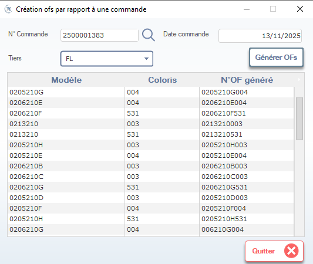
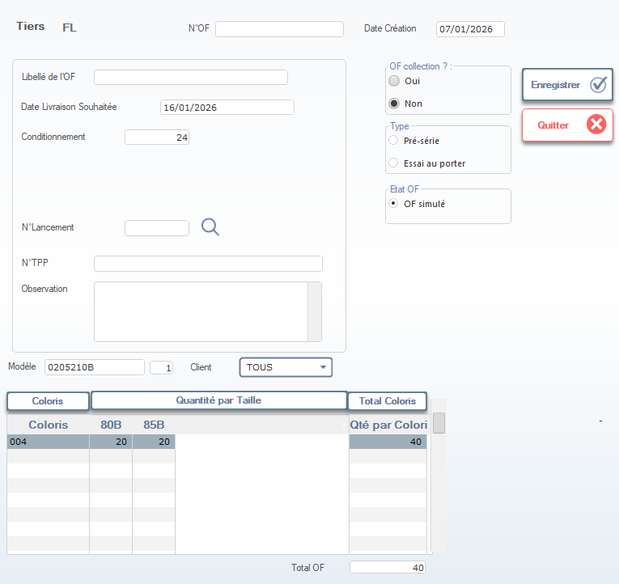

# Documentation : Création des Ordres de Fabrication (OF) depuis une Commande

Cette documentation décrit le processus de génération automatique d’**Ordres de Fabrication (OF)** à partir d’une **commande client**, puis la modification/visualisation détaillée de chaque OF généré.

---

## 1. Fenêtre : Création des OFs par rapport à une commande

> ⚠️ **Remarque** : Cette fenêtre est généralement ouverte depuis un module de gestion commerciale ou de planification. Elle permet de générer des OFs à partir d’une commande existante.

---

### 1.1. En-tête de la fenêtre

#### N° Commande
- Saisissez ou sélectionnez le numéro de la commande client (ex: `2500001383`).  
  → Icône loupe pour rechercher une commande par référence ou client.

#### Date commande
- Date de création de la commande (ex: `13/11/2025`).  
  → Non modifiable — affichée à titre informatif.

#### Tiers
- Sélectionnez le tiers associé à la commande (ex: `FL`).  
  → Doit correspondre au client ou fournisseur lié à la commande.

#### Bouton : Générer OFs
- Cliquez sur ce bouton pour **générer automatiquement les OFs** correspondant aux articles de la commande.  
  → Le système crée un OF par article + coloris + taille si nécessaire.

> ✅ **Résultat** : Une liste d’OFs générés s’affiche dans le tableau ci-dessous.

---

### 1.2. Tableau des OFs générés

Le tableau récapitule les OFs créés automatiquement :

| Colonne | Description |
|---------|-------------|
| **Modèle** | Référence du produit à fabriquer (ex: `0205210G`). |
| **Coloris** | Code couleur associé (ex: `004`, `531`). |
| **N°OF généré** | Numéro unique attribué à chaque OF (ex: `0205210G004`). |

> 💡 **Note** : Chaque ligne représente un OF distinct. Si un modèle a plusieurs coloris/tailles, plusieurs OFs seront générés.

---

### 1.3. Actions disponibles

#### Bouton : Quitter
- Ferme la fenêtre sans sauvegarder les modifications (si aucune action n’a été effectuée, pas de confirmation requise).  
  → Icône ❌ en bas à droite.

> 🔄 **Flux logique** :
> 1. Saisir la commande → 2. Cliquer “Générer OFs” → 3. Vérifier la liste → 4. Accéder à chaque OF pour ajustements (via double-clic ou lien).

---

## 2. Fenêtre : Détail d’un Ordre de Fabrication (OF)

*(Documentée séparément ci-dessous — cette fenêtre s’ouvre après avoir cliqué sur un N°OF généré)*

> 🔗 **Lien entre les deux fenêtres** :  
> Lorsque vous cliquez sur un **N°OF généré** dans le tableau, le système ouvre la fenêtre de détail de cet OF pour édition, validation ou simulation.

---

### 2.1. En-tête de l’ordre

- **Tiers** : `FL` (hérité de la commande)
- **N°OF** : Ex: `0206210F531` (généré automatiquement)
- **Date Création** : `07/01/2026` (date d’enregistrement de l’OF)

---

### 2.2. Paramètres de l’OF

#### Libellé de l’OF
- Champ libre pour description (ex: “Tissu coton 100% – Coloris 531”).

#### Date Livraison Souhaitée
- Date cible de livraison (ex: `16/01/2026`).

#### Conditionnement
- Nombre d’unités par unité de conditionnement (ex: `24`).

---

### 2.3. Options spécifiques

#### OF collection ?
- **Oui / Non** → Pour regrouper les OFs dans une collection (mode textile/mode).

#### Type
- **Pré-série** ou **Essai au porteur** → Affecte les règles métier et coûts.

#### État OF
- **OF simulé** → Mode test, sans impact réel sur stock ou production.

---

### 2.4. Références externes

- **N° Lancement** : Liaison avec un projet ou campagne.
- **N° TPP** : Ticket de Production Planifié (optionnel).
- **Observation** : Notes internes (ex: “Vérifier teinture avant lancement”).

---

### 2.5. Sélection du Modèle & Client

- **Modèle** : `0205210B` (référence produit)
- **Quantité** : `1`
- **Client** : `TOUS` (ou client spécifique)

---

### 2.6. Détails des Coloris et Tailles

Trois onglets disponibles :

#### Onglet : Coloris
- Liste des coloris avec quantités totales (ex: `004` = 40 unités).

#### Onglet : Quantité par Taille
- Répartition par taille (ex: `80B`, `85B`).

#### Onglet : Total Coloris
- Récapitulatif global (ex: `Total OF = 40`).

---

### 2.7. Actions en bas de fenêtre

| Bouton | Fonction |
|--------|----------|
| **Enregistrer** | Sauvegarde les modifications. |
| **Quitter** | Ferme sans sauvegarder (alerte si non sauvegardé). |

---

## 3. Flux complet : De la commande à la production

1. 📥 Ouvrir la fenêtre **“Création OFs par rapport à une commande”**
2. 🔍 Saisir le **N° Commande** et le **Tiers**
3. ⚙️ Cliquer sur **“Générer OFs”**
4. 📋 Vérifier la liste des OFs générés
5. 🔍 Cliquer sur un **N°OF généré** pour ouvrir sa fiche détaillée
6. 🛠️ Modifier les paramètres (date, type, observation, etc.)
7. ✔️ Cliquer sur **“Enregistrer”** pour valider
8. 🏁 L’OF est prêt pour la planification ou la production

---

## 4. Règles & Bonnes Pratiques

- ✅ Toujours vérifier la **date de livraison souhaitée** avant génération.
- ✅ Utiliser **“OF simulé”** pour tester des scénarios sans impact réel.
- ✅ Remplir le champ **Observation** pour noter des contraintes techniques ou commerciales.
- ✅ Pour les collections, activer **“OF collection ? : Oui”** pour faciliter le suivi groupé.

---

✅ Vous maîtrisez maintenant le flux complet de création des ordres de fabrication depuis une commande !

---

📌 **Prochaines étapes possibles** :
- Automatiser la génération d’OFs via API ou script Python.
- Exporter la liste des OFs générés en Excel/PDF.
- Intégrer des validations métier (ex: alerte si date livraison < 7 jours).

Souhaitez-vous que je vous génère :
- Un template Excel pour importer des commandes et générer des OFs ?
- Un script Python pour automatiser cette génération ?
- Une version PDF de cette documentation ?

Je suis là pour vous accompagner ! 🚀