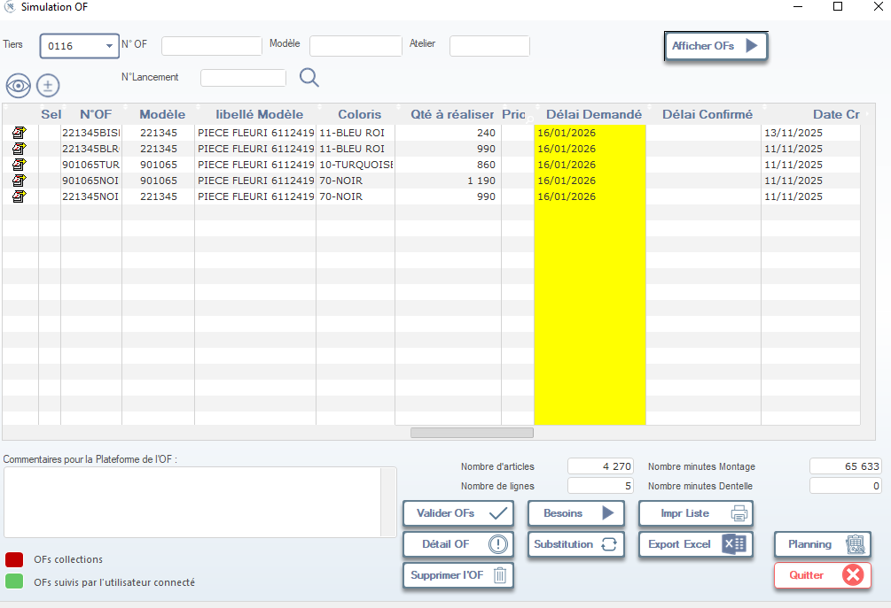

# Documentation : Fenêtre “Simulation OF”

> ⚠️ **Remarque** : Cette fenêtre permet de **simuler, valider ou gérer un ensemble d’Ordres de Fabrication (OF)** avant leur passage en production réelle. Elle est souvent utilisée par les planificateurs, chefs d’atelier ou responsables logistiques.

---

## 1. En-tête de la fenêtre

### Tiers
- Sélectionnez le tiers concerné (ex: `0116`).  
  → Permet de filtrer les OFs liés à un fournisseur, client ou atelier spécifique.

### N° OF
- Champ de recherche pour filtrer par numéro d’OF (ex: `221345BIS`).

### Modèle
- Filtre par référence produit (ex: `221345`).

### Atelier
- Filtre par atelier de production (si applicable).

### Bouton : Afficher OFs
- Cliquez pour **charger les OFs correspondant aux critères sélectionnés**.  
  → Le tableau se met à jour avec les OFs trouvés.

---

## 2. Tableau principal : Liste des OFs simulés

Le tableau affiche les OFs répondant aux filtres appliqués.

| Colonne | Description |
|---------|-------------|
| **Sel** | Icône de sélection (double-clic pour ouvrir l’OF en détail). |
| **N°OF** | Numéro unique de l’ordre de fabrication (ex: `221345BIS`). |
| **Modèle** | Référence du produit (ex: `221345`). |
| **libellé Modèle** | Nom complet du produit (ex: `PIECE FLEURI 6112419`). |
| **Coloris** | Code couleur (ex: `11-BLEU ROI`, `70-NOIR`). |
| **Qté à réaliser** | Quantité totale à produire (ex: `240`, `860`, `1 190`). |
| **Prix** | Prix unitaire (si applicable — ex: `990`). |
| **Délai Demandé** | Date cible de livraison (ex: `16/01/2026`). → **Mis en jaune** pour attirer l’attention sur les délais critiques. |
| **Délai Confirmé** | Date confirmée par l’atelier ou la logistique (si disponible). |
| **Date Cr** | Date de création de l’OF (ex: `13/11/2025`). |

> 📌 **Note** : Les colonnes **“Délai Demandé”** sont mises en évidence en **jaune** pour signaler les échéances prioritaires ou à risque.

---

## 3. Actions disponibles

### Icônes de sélection (à gauche du tableau)
- **👁️** : Visualiser l’OF en mode lecture.
- **➕** : Ajouter un nouvel OF (si autorisé).
- **📝** : Modifier l’OF sélectionné (ouvre la fiche détaillée).

> 💡 **Astuce** : Double-cliquez sur une ligne pour ouvrir directement la fiche détaillée de l’OF.

---

## 4. Zone inférieure : Informations globales & actions

### Commentaires pour la Plateforme de l’OF :
- Champ libre pour notes internes (ex: “Priorité haute – Client VIP”, “Vérifier disponibilité tissu avant validation”).

---

### Statistiques globales

| Champ | Valeur exemple | Description |
|-------|----------------|-------------|
| **Nombre d’articles** | `4 270` | Total des articles à produire dans tous les OFs affichés. |
| **Nombre de lignes** | `5` | Nombre d’OFs affichés dans le tableau. |
| **Nombre minutes Montage** | `65 633` | Temps total estimé pour le montage (en minutes). |
| **Nombre minutes Dentelle** | `0` | Temps estimé pour les opérations de dentelle (si applicable). |

---

## 5. Boutons d’action

| Bouton | Icône | Fonction |
|--------|-------|----------|
| **Valider OFs** | ✔️ | Valide les OFs sélectionnés et les passe en mode “production réelle”. |
| **Besoins** | ▶️ | Ouvre la liste des besoins matières ou ressources associés aux OFs. |
| **Impr Liste** | 🖨️ | Imprime la liste des OFs affichés. |
| **Détail OF** | ℹ️ | Ouvre la fiche détaillée de l’OF sélectionné. |
| **Substitution** | ↻ | Permet de substituer un modèle, coloris ou taille (utile en cas de rupture). |
| **Export Excel** | 📊 | Exporte la liste des OFs au format Excel pour analyse ou partage. |
| **Planning** | 🗓️ | Ouvre le planning de production lié à ces OFs (si intégré). |
| **Supprimer l’OF** | 🗑️ | Supprime l’OF sélectionné (confirmation requise). |
| **Quitter** | ❌ | Ferme la fenêtre sans sauvegarder (alerte si modifications non sauvegardées). |

---

## 6. Légende des indicateurs visuels

En bas à gauche, deux indicateurs colorés :

- 🔴 **OFs collections** : Ordres de fabrication appartenant à une collection (mode textile/mode).
- 🟢 **OFs suivis par l’utilisateur connecté** : OFs assignés ou surveillés par l’utilisateur actuel.

---

## 7. Règles de saisie & validations

- Les champs obligatoires sont validés automatiquement lors de la validation des OFs.
- Si un délai demandé est antérieur à la date courante, un avertissement s’affiche.
- La validation des OFs bloque toute modification ultérieure sans droits spécifiques.

---

## 8. Astuces & Bonnes Pratiques

✅ **Avant validation** :
- Vérifiez toujours les **délais demandés** (jaunes) pour anticiper les retards.
- Utilisez **“Besoins”** pour vérifier la disponibilité des matières premières.
- Ajoutez des **commentaires** pour guider les équipes de production.

✅ **Pour optimiser** :
- Utilisez **“Export Excel”** pour analyser les volumes par modèle ou coloris.
- Utilisez **“Planning”** pour visualiser les charges de travail par atelier.

✅ **En cas de problème** :
- Utilisez **“Substitution”** pour remplacer un article indisponible.
- Utilisez **“Supprimer l’OF”** uniquement si l’OF n’a pas encore été lancé.

---

## 9. Flux typique d’utilisation

1. 🎯 Filtrer les OFs par **Tiers**, **Modèle** ou **Atelier**
2. 🔍 Cliquer sur **“Afficher OFs”** pour charger la liste
3. 📊 Vérifier les **délais demandés** (jaunes) et les **statistiques globales**
4. 🛠️ Modifier ou ajouter des OFs via les icônes ou double-clic
5. 📝 Ajouter des **commentaires** pour le suivi
6. ✅ Cliquer sur **“Valider OFs”** pour passer en production
7. 📤 Exporter ou imprimer la liste si nécessaire

---

✅ Vous êtes maintenant prêt(e) à utiliser efficacement la fenêtre **“Simulation OF”** pour planifier, valider et piloter vos ordres de fabrication !

---

📌 **Prochaines étapes possibles** :
- Automatiser la validation des OFs via script ou API.
- Intégrer des alertes email pour les délais critiques.
- Créer un dashboard Power BI/Excel à partir des exports Excel.

Souhaitez-vous que je vous génère :
- Un **template Excel** pour importer des OFs ?
- Un **script Python** pour automatiser la validation des OFs ?
- Une **version PDF** de cette documentation ?

Je suis là pour vous accompagner ! 🚀