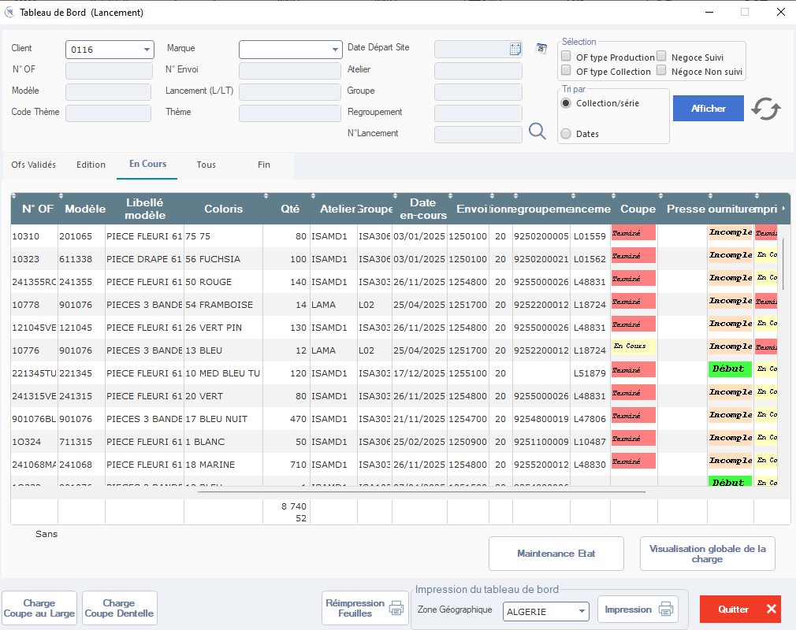

# Documentation : Fenêtre “Tableau de Bord (Lancement)”

> ⚠️ **Remarque** : Cette fenêtre permet de **suivre l’état global des ordres de fabrication (OFs) en cours de lancement**, depuis la validation jusqu’à la fin de production. Elle est utilisée par les responsables de production, logistiques et planification pour piloter les flux.

---

## 1. En-tête de la fenêtre

### Filtres principaux

| Champ | Description |
|-------|-------------|
| **Client** | Sélectionnez le client concerné (ex: `0116`). → Permet de filtrer les OFs par destinataire. |
| **Marque** | Filtre par marque (si applicable). |
| **Date Départ Site** | Date de départ du site de production (ex: `03/01/2025`). |
| **N° OF** | Recherche par numéro d’OF (ex: `10310`, `10323`). |
| **N° Envoi** | Numéro d’envoi logistique (si applicable). |
| **Atelier** | Filtre par atelier de production (ex: `ISAMD1`, `LAMA`). |
| **Modèle** | Référence produit (ex: `201065`, `611338`). |
| **Lancement (L/LT)** | Numéro de lancement ou lot (ex: `241355RC`). |
| **Groupe** | Groupe de production (ex: `ISA306`, `LO2`). |
| **Code Thème** / **Thème** | Filtre par thème de collection (ex: “Fleurs”, “Bandes”). |
| **Regroupement** | Regroupement logistique ou commercial. |
| **N° Lancement** | Numéro unique du lancement (ex: `L01559`). |

> 🔍 Icône loupe à côté de chaque champ → permet de rechercher une valeur dans la base.

---

## 2. Options de sélection & tri

### Sélection
- ☐ **OF type Production** : Affiche uniquement les OFs de production standard.
- ☐ **OF type Collection** : Affiche les OFs liés à une collection (mode textile).
- ☐ **Negoc Suivi** / **Négoce Non suivi** : Filtre selon le statut commercial.

### Tri par
- ● **Collection/série** → Tri par thème ou série (par défaut).
- ○ **Dates** → Tri chronologique par date de départ ou création.

### Bouton : Afficher
- Cliquez pour **charger les données selon les filtres sélectionnés**.
- 🔄 Icône de rafraîchissement → Actualise les données sans réinitialiser les filtres.

---

## 3. Onglets de statut

La barre d’onglets permet de filtrer les OFs selon leur état :

| Onglet | Description |
|--------|-------------|
| **OFs Validés** | OFs validés mais pas encore lancés. |
| **Édition** | OFs en cours de modification. |
| **En Cours** | **Onglet actif ici** — OFs en production ou en transit. |
| **Tous** | Tous les OFs, quel que soit leur statut. |
| **Fin** | OFs terminés ou archivés. |

> ✅ L’onglet **“En Cours”** est sélectionné par défaut sur cette capture.

---

## 4. Tableau principal : Liste des OFs en cours

Le tableau affiche les OFs répondant aux critères sélectionnés.

| Colonne | Description |
|---------|-------------|
| **N° OF** | Numéro unique de l’ordre de fabrication (ex: `10310`). |
| **Modèle** | Référence du produit (ex: `201065`). |
| **Libellé modèle** | Nom complet du produit (ex: `PIECE FLEURI 61 75 75`). |
| **Coloris** | Code couleur (ex: `56 FUCHSIA`, `61 50 ROUGE`). |
| **Qté** | Quantité totale à produire (ex: `80`, `100`, `140`). |
| **Atelier** | Atelier assigné (ex: `ISAMD1`, `LAMA`). |
| **Groupe** | Groupe de production (ex: `ISA306`, `LO2`). |
| **Date en-cours** | Date de mise en production (ex: `03/01/2025`). |
| **Envoi** | Numéro d’envoi logistique (ex: `1250100`). |
| **Regroupement** | Numéro de regroupement (ex: `9252000005`). |
| **Coupe** | Statut de la coupe : 🔴 **Terminé** 🟡 **En Cours** 🟢 **Début** |
| **Presse ourniture/emploi** | Statut de la presse ouvrage/emplois : 🔴 **Incomplet** 🟡 **En Co** (en cours) 🟢 **Terminé** |

> 📌 **Note** : Les cellules sont colorées pour indiquer le statut :
> - 🔴 = Bloqué / À traiter
> - 🟡 = En cours
> - 🟢 = Terminé / Prêt

---

## 5. Statistiques globales

En bas du tableau, un résumé des quantités :

| Champ | Valeur exemple | Description |
|-------|----------------|-------------|
| **Sans** | `8 740` | Total des quantités non affectées ou hors statut. |
| | `52` | Nombre de lignes affichées. |

---

## 6. Actions disponibles

### Boutons en bas de fenêtre

| Bouton | Fonction |
|--------|----------|
| **Maintenance État** | Ouvre l’outil de correction manuelle des états des OFs. |
| **Visualisation globale de la charge** | Ouvre un dashboard visuel de la charge de travail par atelier ou groupe. |
| **Charge Coupe au Large** | Calcule et affiche la charge de coupe large (si applicable). |
| **Charge Coupe Dentelle** | Calcule et affiche la charge de coupe dentelle (si applicable). |
| **Réimpression Feuilles** | Imprime les feuilles de production ou de suivi. |
| **Impression du tableau de bord** | Imprime le tableau actuel (avec filtres appliqués). |
| **Zone Géographique** | Sélectionnez la zone géographique (ex: `ALGERIE`) pour filtrer les expéditions. |
| **Impression** | Imprime le tableau avec options de format. |
| **Quitter** | Ferme la fenêtre (alerte si modifications non sauvegardées). |

---

## 7. Légende des indicateurs visuels

Les couleurs dans les colonnes **“Coupe”** et **“Presse ourniture/emploi”** ont une signification métier :

- 🔴 **Terminé / Incomplet** → Tâche terminée ou bloquée.
- 🟡 **En Cours / En Co** → Tâche en cours de traitement.
- 🟢 **Début / Terminé** → Tâche démarrée ou complètement finalisée.

> 💡 **Astuce** : Utilisez ces indicateurs pour identifier rapidement les goulots d’étranglement ou les OFs bloqués.

---

## 8. Règles de saisie & validations

- Les filtres sont appliqués dynamiquement lors du clic sur **“Afficher”**.
- Les données sont actualisées en temps réel (ou après rafraîchissement manuel).
- Les OFs “Terminés” ne peuvent généralement pas être modifiés sans droits spécifiques.

---

## 9. Astuces & Bonnes Pratiques

✅ **Pour suivre efficacement** :
- Utilisez les **filtres par Atelier** ou **Groupe** pour isoler les charges locales.
- Triez par **Dates** pour prioriser les OFs les plus urgents.
- Vérifiez les colonnes **“Coupe”** et **“Presse”** pour anticiper les retards.

✅ **Pour optimiser la production** :
- Utilisez **“Visualisation globale de la charge”** pour équilibrer les ateliers.
- Exportez les données via **“Impression du tableau de bord”** pour partage avec les équipes.

✅ **En cas de blocage** :
- Utilisez **“Maintenance État”** pour corriger manuellement un statut erroné.
- Contactez le responsable de l’atelier si un OF reste en **“En Cours”** trop longtemps.

---

## 10. Flux typique d’utilisation

1. 🎯 Appliquez les filtres (Client, Atelier, Date, etc.)
2. 🔍 Cliquez sur **“Afficher”** pour charger les OFs
3. 📊 Analysez les statuts dans les colonnes **“Coupe”** et **“Presse”**
4. 📈 Utilisez **“Visualisation globale de la charge”** pour ajuster les ressources
5. 🖨️ Imprimez ou exportez les données si nécessaire
6. 🛠️ Utilisez **“Maintenance État”** en cas de besoin
7. ❌ Quittez la fenêtre quand vous avez terminé

---

✅ Vous êtes maintenant prêt(e) à utiliser efficacement le **Tableau de Bord (Lancement)** pour piloter vos ordres de fabrication en temps réel !

---

📌 **Prochaines étapes possibles** :
- Automatiser l’export des données vers Excel/Power BI.
- Créer des alertes email pour les OFs bloqués.
- Intégrer un dashboard visuel interactif.

Souhaitez-vous que je vous génère :
- Un **template Excel** pour importer/exporter les données ?
- Un **script Python** pour automatiser l’extraction des OFs ?
- Une **version PDF** de cette documentation ?

Je suis là pour vous accompagner ! 🚀