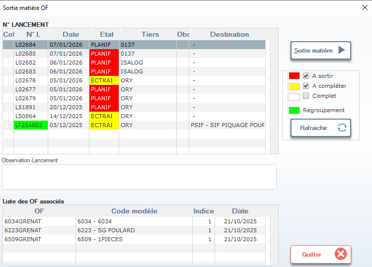

# Sortie Matière OF

Cette fenêtre permet de gérer et visualiser les ordres de fabrication (OF) en cours de sortie matière. Elle affiche l’état des lancements, leur date, leur fournisseur, et les OF associés, facilitant ainsi la planification logistique et la traçabilité des consommations.

> ⚠️ **Remarque** : Les couleurs dans la colonne *Etat* indiquent le statut du lancement et doivent être interprétées selon la légende fournie.

---

## 1. En-tête de la fenêtre

### Titre
- **Sortie matière OF** : Indique que cette fiche concerne la gestion des sorties de matières liées aux ordres de fabrication.

---

## 2. Tableau principal — Lancements

Affiche la liste des lancements avec leurs informations clés :

| Colonne         | Description |
|-----------------|-------------|
| **Col**         | Colonne de tri ou indicateur visuel (peut correspondre à un groupe ou priorité). |
| **N° L**        | Numéro unique du lancement (ex: `L02684`, `L02677`). |
| **Date**        | Date de création ou de planification du lancement (ex: `07/01/2026`). |
| **Etat**        | Statut du lancement (voir légende ci-dessous). |
| **Tiers**       | Fournisseur ou site impliqué (ex: `0137`, `ORY`, `ISALOG`). |
| **Obs**         | Observation ou remarque libre (peut être vide). |
| **Destination** | Destination finale du produit (ex: `PSIF - SIF PIQUAGE POUR...`). |

> 📌 **Note** : Le champ **Observation Lancement** en bas permet d’ajouter un commentaire global sur le lancement sélectionné.

---

## 3. Légende des états (couleurs)

Les couleurs dans la colonne **Etat** sont codées selon la légende suivante :

| Couleur | État          | Signification |
|---------|---------------|---------------|
| 🔴 **Rouge**   | **A sortir**      | Le lancement est planifié mais aucune matière n’a encore été sortie. |
| 🟡 **Jaune**   | **A compléter**   | La sortie matière a commencé, mais n’est pas terminée. |
| ⚪ **Gris**    | **Complet**       | Toutes les matières ont été sorties pour ce lancement. |
| 🟢 **Vert**    | **Regroupement**  | Le lancement fait partie d’un regroupement logistique ou de production. |

> 💡 **Conseil** : Utilisez les filtres de couleur pour identifier rapidement les lancements en retard ou bloqués.

---

## 4. Actions disponibles

| Bouton             | Icône | Fonction |
|--------------------|-------|----------|
| **Sortie matière** | ▶️    | Lance ou finalise la sortie matière pour le lancement sélectionné. |
| **Rafraîchir**     | ↻     | Met à jour les données affichées (utile après une modification externe). |
| **Quitter**        | ❌    | Ferme la fenêtre sans sauvegarder (aucune donnée n’est modifiée ici). |

> ✅ **Bonnes pratiques** :
> - Toujours vérifier l’état **Etat** avant de cliquer sur **Sortie matière**.
> - Pour les lancements **A sortir**, s’assurer que les matières sont disponibles en stock.
> - Si **Destination** est remplie, confirmer avec le service logistique avant validation.

---

## 5. Liste des OF associés

Affiche les ordres de fabrication liés au lancement sélectionné :

| Colonne           | Description |
|-------------------|-------------|
| **OF**            | Numéro de l’ordre de fabrication (ex: `6034GRENAT`). |
| **Code modèle**   | Référence du modèle produit (ex: `6034 - 6034`, `6223 - SG FOULARD`). |
| **Indice**        | Version ou variante du modèle (ex: `1`). |
| **Date**          | Date de création ou de planification de l’OF (ex: `21/10/2025`). |

> 📊 **Utilité** : Permet de remonter du lancement aux OF spécifiques, utile pour la traçabilité qualité ou logistique.

---

## 6. Astuces & Bonnes Pratiques

- **Suivi quotidien** : Vérifiez les lancements en **jaune** chaque matin pour anticiper les retards.
- **Regroupement vert** : Utilisez cette fonction pour optimiser les flux logistiques entre plusieurs OF.
- **Export Excel** : Bien que non visible ici, si disponible, exportez les données pour analyser les délais moyens de sortie matière.
- **Coordination** : Communiquez avec les équipes atelier et logistique avant de valider une sortie matière.

---

✅ Vous êtes maintenant capable de piloter efficacement les sorties matières liées aux ordres de fabrication, en maîtrisant les états, les OF associés et les actions possibles.