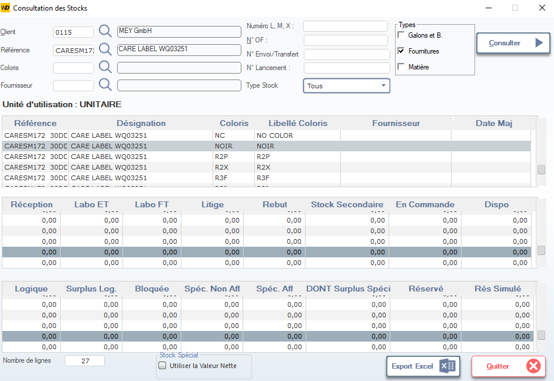

# Consultation des Stocks

Cette fenêtre permet de consulter en temps réel les niveaux de stock d’une référence spécifique, par coloris et par type de stock. Elle est utilisée pour suivre la disponibilité physique, logique et réservée des matières premières ou produits finis.

> ⚠️ **Remarque** : Les données affichées sont dynamiques et reflètent l’état actuel du système. Une mise à jour manuelle peut être nécessaire après une modification importante.

---

## 1. En-tête de recherche

Permet de filtrer les stocks selon plusieurs critères :

### Client
- Sélectionnez un client via la loupe (ex: `0115` → `MEY GmbH`).

### Référence
- Saisissez ou recherchez la référence du produit (ex: `CARESM172`).

### Coloris
- Filtrez par code couleur (ex: `NOIR`, `R2P`, etc.).

### Fournisseur
- Recherchez un fournisseur spécifique (ex: `MAISON LEVEQUE SARL`).

### Numéro L, M, X / N° OF / N° Envoi / N° Lancement
- Champs optionnels pour affiner la recherche selon des numéros internes (ordre de fabrication, envoi, lancement…).

### Type Stock
- Sélectionnez le type de stock à afficher :
  - **Tous** (par défaut)
  - **Galons et B.**
  - **Fournitures** ✅ (coché dans l’exemple)
  - **Matière**

> 💡 **Astuce** : Cliquez sur **Consulter** pour lancer la recherche avec les filtres sélectionnés.

---

## 2. Informations générales

### Unité d’utilisation
- Affiche l’unité de gestion du stock (ex: `UNITAIRE`).

---

## 3. Tableau principal — Détails des références

Affiche les lignes correspondant aux filtres appliqués :

| Colonne           | Description |
|-------------------|-------------|
| **Référence**     | Code interne de la matière ou produit (ex: `CARESM172 30DC`). |
| **Désignation**   | Libellé complet de la référence (ex: `CARE LABEL WQ03251`). |
| **Coloris**       | Code couleur (ex: `NC`, `R2P`, `R3F`). |
| **Libellé Coloris** | Nom complet du coloris (ex: `NO COLOR`, `R2P`). |
| **Fournisseur**   | Fournisseur associé à cette ligne (peut être vide). |
| **Date Maj**      | Date de dernière mise à jour du stock. |

> 📌 **Note** : Plusieurs lignes peuvent apparaître pour une même référence si elle existe en plusieurs coloris ou fournisseurs.

---

## 4. Tableau des niveaux de stock

Pour chaque ligne, les quantités sont détaillées par type de stock :

| Colonne             | Description |
|---------------------|-------------|
| **Réception**       | Quantité reçue mais non encore validée ou imputée. |
| **Labo ET**         | Stock en attente de contrôle qualité technique. |
| **Labo FT**         | Stock en attente de contrôle qualité fonctionnel. |
| **Litige**          | Stock en litige (problème qualité, retour, etc.). |
| **Rebut**           | Stock mis au rebut. |
| **Stock Secondaire**| Stock en entrepôt secondaire ou hors site. |
| **En Commande**     | Quantité commandée mais non encore livrée. |
| **Dispo**           | Disponibilité immédiate (réception + stock secondaire – en commande – réservé). |

> ✅ **Valeur clé** : Le champ **Dispo** est crucial pour la planification de production.

---

## 5. Tableau des stocks logiques et réservés

Détail des stocks non physiques ou affectés :

| Colonne              | Description |
|----------------------|-------------|
| **Logique**          | Stock théorique calculé par le système. |
| **Surplus Log.**     | Excédent de stock logique. |
| **Bloquée**          | Stock bloqué (ex: pour maintenance, audit). |
| **Spéc. Non Aff**    | Stock spécifié mais non affecté à un ordre. |
| **Spéc. Aff**        | Stock spécifié et affecté à un ordre. |
| **DONT Surplus Spéci** | Surplus inclus dans les spécifications. |
| **Réservé**          | Stock réservé pour une commande ou un OF. |
| **Rés Simulé**       | Stock simulé (résultat d’un scénario de planification). |

---

## 6. Actions en bas de fenêtre

| Bouton             | Icône | Fonction |
|--------------------|-------|----------|
| **Export Excel**   | 📊    | Exporte les données affichées dans un fichier Excel (.xlsx). |
| **Quitter**        | ❌    | Ferme la fenêtre sans sauvegarder (aucune donnée n’est modifiée ici). |
| **Utiliser la Valeur Nette** | ☑️ | Cochez cette case pour afficher les valeurs nettes (après déduction des rebuts/litiges). |

> 💡 **Conseil** : Utilisez l’export Excel pour analyser les tendances de stock sur plusieurs périodes ou partager les données avec la direction.

---

## 7. Bonnes pratiques

- Toujours vérifier que **Dispo > 0** avant de lancer une production.
- Si **En Commande** est élevé, envisagez un ajustement des délais fournisseurs.
- Utilisez **Labo ET/FT** pour identifier les retards de validation qualité.
- Pour les matières critiques, surveillez **Réservé** et **Rés Simulé** pour anticiper les pénuries.

---

✅ Vous êtes maintenant capable de lire, interpréter et exploiter efficacement la consultation des stocks dans votre système ERP.