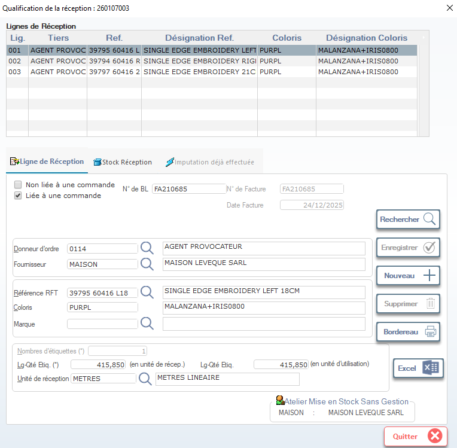

# Qualification de la Réception

Cette fiche permet de qualifier les lignes de réception des matières premières ou produits finis après leur arrivée physique. Elle est utilisée pour valider les quantités reçues, les associer à une commande, et imputer les données dans le système de gestion des stocks.

> ⚠️ **Remarque** : Seuls les utilisateurs ayant les droits appropriés (ex: logistique, qualité, approvisionnement) peuvent valider ou modifier une réception.

---

## 1. En-tête de la fenêtre

### Numéro de Réception
- Affiche le numéro unique de la réception (ex: `260107003`).
- Ce numéro est généré automatiquement par le système lors de la création de la réception.

---

## 2. Tableau des Lignes de Réception

Affiche la liste des articles reçus, avec les informations suivantes :

| Colonne             | Description                                                                 |
|---------------------|-----------------------------------------------------------------------------|
| **Lig.**            | Numéro de ligne dans la réception (ex: `001`, `002`).                       |
| **Tiers**           | Fournisseur ou agent provoquant la réception (ex: `AGENT PROVOC`).          |
| **Ref.**            | Référence interne du produit reçu (ex: `39795 60416 L`).                    |
| **Désignation Ref.**| Libellé technique de la référence (ex: `SINGLE EDGE EMBROIDERY LEFT PURPL`).|
| **Coloris**         | Code couleur de la matière (ex: `PURPL`).                                   |
| **Désignation Coloris** | Nom complet du coloris (ex: `MALANZANA+IRIS0800`).                      |

> 💡 **Conseil** : Double-cliquez sur une ligne pour accéder aux détails techniques ou au suivi qualité associé.

---

## 3. Onglets de la fiche

La fiche contient trois onglets principaux :

- **Ligne de Réception** → Informations détaillées de la ligne sélectionnée.
- **Stock Réception** → Détails du stock entrant et affectation au magasin.
- **Imputation déjà effectuée** → Historique des imputations financières ou comptables liées à cette réception.

---

## 4. Actions disponibles

Les boutons situés en bas de la fenêtre permettent d’interagir avec la réception :

| Bouton        | Icône | Fonction |
|---------------|-------|----------|
| **Valider**   | ✔️    | Confirme la réception et met à jour le stock. |
| **Annuler**   | ❌    | Annule la qualification et retourne à l’état précédent. |
| **Imprimer**  | 🖨️    | Génère un bon de réception imprimable. |
| **Quitter**   | 🔙    | Ferme la fenêtre sans sauvegarder les modifications non validées. |

> ✅ **Bonnes pratiques** :
> - Toujours vérifier la cohérence entre la référence, le coloris et la désignation avant validation.
> - En cas d’écart (quantité, qualité), utiliser l’onglet **Ligne de Réception** pour ajouter des commentaires ou déclencher un contrôle qualité.