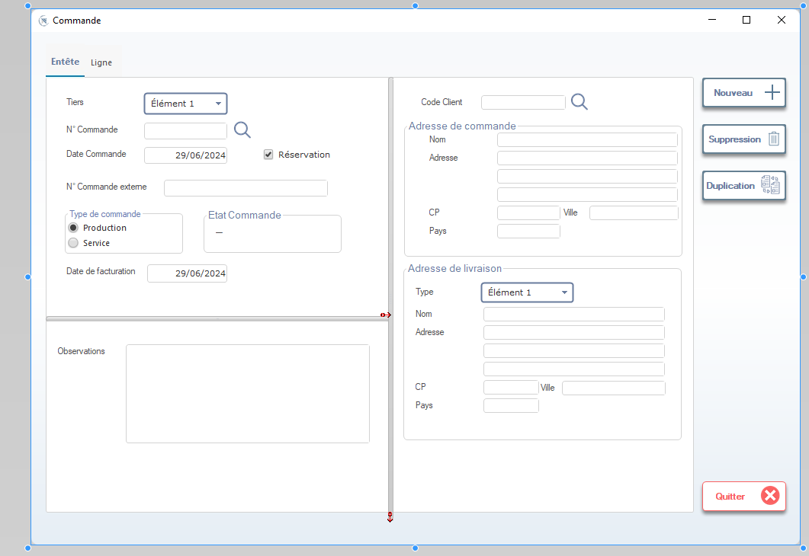
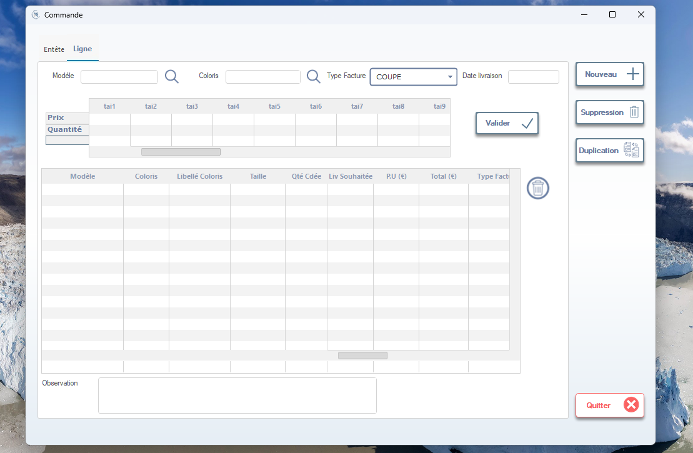

# 📦 Écran : Commande

Ce document décrit l’interface complète de gestion des **Commandes**, composée de deux onglets :
- **Entête**
- **Ligne**

Cet écran permet de créer, modifier et suivre une commande client.

---

## 🖼️ Onglet : Entête

L’onglet *Entête* regroupe l’ensemble des informations générales liées à la commande.

---

## 🔷 Zone Informations de commande

### **Tiers**
- Sélection du tiers (client ou entité associée).

### **N° Commande**
- Identifiant interne de la commande, avec recherche rapide.

### **Date Commande**
- Date de création de la commande.

### **Réservation**
- Case à cocher permettant de réserver les quantités.

### **N° Commande externe**
- Référence fournie par le client.

### **Type de commande**
- Deux options :
  - 🔘 Production  
  - 🔘 Service

### **État Commande**
- Indique l’état actuel (ex : en cours, validé, annulé…).

### **Date de facturation**
- Date prévue pour la facturation.

---

## 📮 Adresse de commande

Section permettant de gérer les informations du client :

- Nom  
- Adresse  
- Ville  
- Code Postal  
- Pays  

### **Code Client**
- Recherche d’un client via son code.

---

## 🚚 Adresse de livraison

Zone dédiée aux informations logistiques :

- **Type** (ex : Élément 1)
- Nom  
- Adresse  
- Ville  
- CP  
- Pays  

---

## 📝 Observations

Zone de texte libre permettant d’ajouter des notes concernant la commande.

---

## 🔘 Actions disponibles (à droite)

### **Nouveau**
Créer une nouvelle commande.

### **Suppression**
Supprimer la commande sélectionnée.

### **Duplication**
Créer une copie de la commande existante.

### **Quitter**
Fermer la fenêtre.

---

# 📄 Onglet : Ligne

Cet onglet permet de gérer le détail des lignes de commande : produits, quantités, prix, tailles…

---

## 🔷 Critères de sélection

### **Modèle**
- Sélection d’un modèle avec recherche.

### **Coloris**
- Sélection du coloris.

### **Type Facture**
- Ex : COUPE, etc.

### **Date Livraison**
- Date souhaitée pour la livraison.

---

## 📊 Tableau des tailles

Un tableau horizontal permet de spécifier, pour un même modèle, les quantités par taille (tai1 à tai9).

Colonnes :
- tai1  
- tai2  
- …  
- tai9  

---

## 🧮 Zone Prix & Quantité

- **Prix**
- **Quantité**

L’utilisateur saisit ici les valeurs permettant de générer automatiquement la ligne dans le tableau.

Bouton :
- ✔️ **Valider**

---

## 📋 Tableau des lignes de commande

Contient l’ensemble des lignes ajoutées :

- Modèle  
- Coloris  
- Libellé Coloris  
- Taille  
- Qté Cédée  
- Liv Souhaitée  
- P.U (€)  
- Total (€)  
- Type Facture  

---

## 📝 Observation (Ligne)

Zone de texte libre spécifique à une ligne de commande.

---

## 🔘 Actions (à droite)

### **Nouveau**
Ajouter une nouvelle ligne.

### **Suppression**
Supprimer la ligne sélectionnée.

### **Duplication**
Copier une ligne existante.

### **Quitter**
Fermer l’écran.

---

## 📚 Résumé général

L’écran *Commande* permet :
- la gestion complète d’une commande client,
- la création de lignes avec tailles, prix et conditions de livraison,
- la gestion des adresses,
- la duplication rapide,
- et l’édition avancée des informations logistiques.

Cet outil constitue un module central pour le workflow commercial et logistique.

