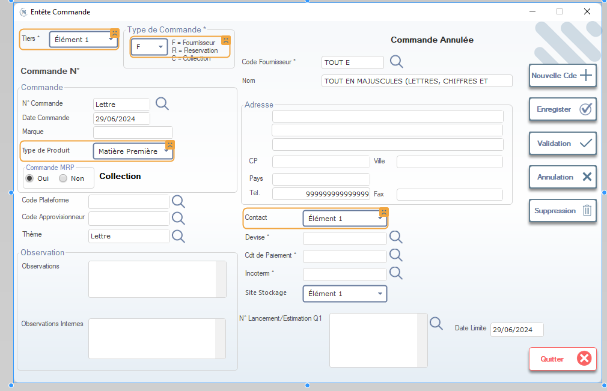

# Entête Commande – Formulaire de Saisie

Ce document décrit l’ensemble des champs et fonctionnalités présents dans l’écran **Entête Commande**.

## Vue d’ensemble
L’écran *Entête Commande* permet de saisir les informations relatives à une commande : tiers, type de commande, date, produit, fournisseur, adresse, observations, etc.  
Il offre également plusieurs actions telles que la création, l’enregistrement, la validation ou l’annulation d’une commande.

---

## Champs et Informations

### 1. **Tiers**
- **Description** : Indique le tiers associé à la commande.
- **Valeur Exemple** : `Élément 1`
- **Type de contrôle** : Liste déroulante.

### 2. **Type de Commande**
- **Description** : Définit la nature de la commande.
- **Options** :
  - `F = Fournisseur`
  - `R = Réservation`
  - `C = Collection`
- **Type de contrôle** : Liste déroulante.
- **Exemple** : `F = Fournisseur`

### 3. **Commande N°**
- **Description** : Numéro de la commande.
- **Exemple** : `Lettre`
- **Type de contrôle** : Champ texte.

### 4. **Date Commande**
- **Description** : Date de création de la commande.
- **Exemple** : `29/06/2024`
- **Type de contrôle** : Sélecteur de date.

### 5. **Marque**
- **Description** : Marque liée à la commande.
- **Type de contrôle** : Champ texte ou liste déroulante.

### 6. **Type de Produit**
- **Description** : Type de produit concerné.
- **Exemple** : `Matière Première`
- **Type de contrôle** : Liste déroulante.

### 7. **Commande MRP**
- **Description** : Indique s’il s’agit d’une commande MRP.
- **Options** : `Oui` / `Non`
- **Type de contrôle** : Boutons radio.

### 8. **Code Fournisseur**
- **Description** : Code du fournisseur.
- **Type de contrôle** : Champ avec recherche.

### 9. **Adresse Fournisseur**
Contient :
- Adresse
- Code Postal
- Pays
- Ville
- Téléphone (ex. : `9999999999999`)
- Fax

### 10. **Contact**
- **Description** : Contact associé au fournisseur ou tiers.
- **Exemple** : `Élément 1`
- **Type de contrôle** : Liste déroulante.

### 11. **Devise**
- **Description** : Devise de la commande.
- **Type de contrôle** : Liste déroulante.

### 12. **Code de Paiement**
- **Description** : Code utilisé pour définir les conditions de paiement.
- **Type de contrôle** : Champ avec recherche.

### 13. **Incoterm**
- **Description** : Incoterm applicable à l’expédition.
- **Type de contrôle** : Champ texte.

### 14. **Site de Stockage**
- **Description** : Site où les marchandises sont stockées.
- **Type de contrôle** : Liste déroulante ou champ texte.

### 15. **N° Lancement / Estimation Q1**
- **Description** : Numéro d’estimation ou de lancement.
- **Type de contrôle** : Champ texte.

### 16. **Date Limite**
- **Description** : Date limite associée à la commande.
- **Exemple** : `29/06/2024`
- **Type de contrôle** : Sélecteur de date.

### 17. **Observations**
- **Description** : Zone de texte permettant d’ajouter des remarques générales.
- **Type de contrôle** : Champ texte multiligne.

### 18. **Observations Internes**
- **Description** : Remarques internes réservées à l’entreprise.
- **Type de contrôle** : Champ texte multiligne.

---

## Boutons et Actions

### **Nouvelle Cde**
- Crée une nouvelle commande.

### **Enregistrer**
- Sauvegarde les informations saisies.

### **Validation**
- Valide la commande.

### **Annulation**
- Annule la commande en cours.

### **Suppression**
- Supprime la commande sélectionnée.

### **Quitter**
- Quitte l’écran ou le module.

---

