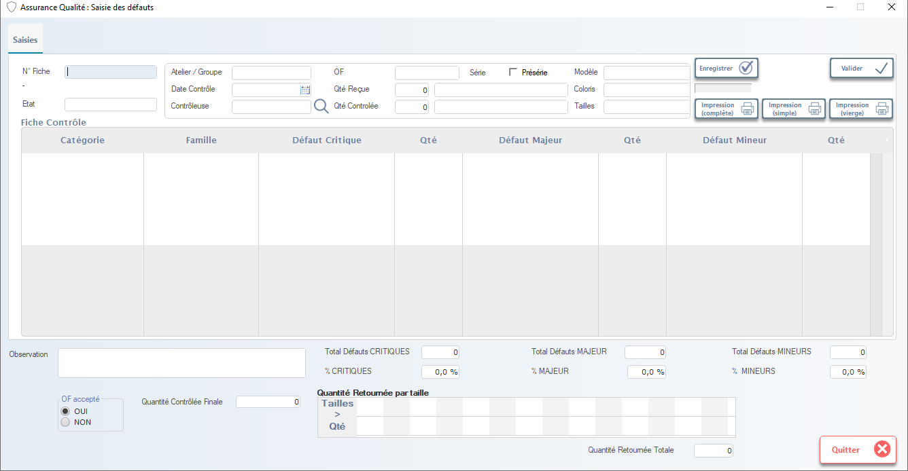

# Assurance Qualité — Saisie des Défauts

Cette fenêtre permet de **saisir et classifier les défauts qualité** détectés lors du contrôle des produits finis. Elle est utilisée pour mesurer la performance qualité, identifier les tendances, et piloter les actions correctives dans les ateliers de production.

> ⚠️ **Remarque** : Ce module est essentiel pour la gestion de la qualité client. Toute erreur de saisie peut fausser les indicateurs de performance et masquer des problèmes récurrents.

---

## 1. En-tête de saisie

### N° Fiche
- Numéro unique de la fiche de contrôle (généré automatiquement ou saisi manuellement).

### Atelier / Groupe
- Sélectionnez l’atelier ou le groupe de production concerné (ex: `LA102`, `SWING`).

### OF / Série / Modèle / Coloris / Tailles
- Champs obligatoires pour lier le défaut à un produit spécifique.
- Utilisez la loupe pour rechercher rapidement.

> 💡 **Astuce** : Ces champs sont souvent pré-remplis depuis le bon de livraison ou le ticket de production.

---

## 2. Informations de contrôle

### Date Contrôle
- Date à laquelle le contrôle a été effectué (ex: `08/01/2026`).

### Contrôleuse
- Nom ou matricule de la personne ayant effectué le contrôle.

### Qté Requise / Qté Contrôlée
- **Qté Requise** : Quantité demandée pour le contrôle (ex: 100 pièces).
- **Qté Contrôlée** : Quantité réellement inspectée.

> 📌 **Note** : Si `Qté Contrôlée < Qté Requise`, cela peut indiquer un échantillonnage ou un problème logistique.

---

## 3. Fiche Contrôle — Classification des défauts

Tableau principal pour saisir les défauts par catégorie :

| Colonne             | Description |
|---------------------|-------------|
| **Catégorie**       | Type de défaut (ex: `Tissu`, `Couture`, `Finition`). |
| **Famille**         | Sous-catégorie (ex: `Décoloration`, `Surpiqûre`, `Bouton`). |
| **Défaut Critique** | Libellé du défaut critique (ex: “trou”, “manque pièce”). |
| **Qté**             | Nombre de pièces affectées par ce défaut critique. |
| **Défaut Majeur**   | Libellé du défaut majeur (ex: “défaut de couture”, “tache visible”). |
| **Qté**             | Nombre de pièces affectées par ce défaut majeur. |
| **Défaut Mineur**   | Libellé du défaut mineur (ex: “fil tiré”, “petit pli”). |
| **Qté**             | Nombre de pièces affectées par ce défaut mineur. |

> ✅ **Validation** : Le système ne permet pas d’enregistrer sans au moins un défaut saisi (si `Qté Contrôlée > 0`).

---

## 4. Statistiques automatisées

Affiche les totaux et pourcentages calculés automatiquement :

| Champ                     | Description |
|---------------------------|-------------|
| **Total Défauts CRITIQUES** | Somme des défauts critiques. |
| **% CRITIQUES**           | Pourcentage de défauts critiques sur la quantité contrôlée. |
| **Total Défauts MAJEUR**  | Somme des défauts majeurs. |
| **% MAJEUR**              | Pourcentage de défauts majeurs. |
| **Total Défauts MINEURS** | Somme des défauts mineurs. |
| **% MINEURS**             | Pourcentage de défauts mineurs. |

> 📊 **Utilité** : Ces indicateurs servent à :
> - Évaluer la qualité globale d’un OF ou d’un atelier.
> - Identifier les zones à améliorer (ex: si `% CRITIQUES > 5 %` → alerte rouge).

---

## 5. Quantité Retournée par taille

Zone pour saisir les retours par taille (utile pour les vêtements) :

| Taille | Qté Retournée |
|--------|---------------|
| S      | 0             |
| M      | 2             |
| L      | 1             |
| XL     | 0             |

> 📈 **Objectif** : Identifier si certains défauts sont liés à une taille spécifique (ex: problèmes de coupe sur les tailles grandes).

---

## 6. Observation & Validation

### Observation
- Zone libre pour ajouter des commentaires complémentaires (ex: “problème récurrent sur col”, “défaut lié à la machine X”).

### OF accepté ?
- Cochez **OUI** si le lot est conforme malgré les défauts mineurs/majeurs.
- Cochez **NON** si le lot doit être entièrement retourné en réparation.

> ✅ **Bonnes pratiques** :
> - Toujours justifier votre décision dans **Observation**.
> - Ne laissez jamais cette zone vide si vous cochez **NON**.

---

## 7. Actions disponibles

| Bouton                | Icône | Fonction |
|-----------------------|-------|----------|
| **Enregistrer**       | ✔️    | Sauvegarde les données saisies (sans valider le lot). |
| **Valider**           | ✔️    | Valide le contrôle et met à jour le stock (produits fins ou réparation). |
| **Impression (complète)** | 🖨️ | Imprime la fiche complète avec tous les défauts et statistiques. |
| **Impression (simple)** | 🖨️ | Imprime un résumé pour l’atelier. |
| **Impression (vierge)** | 🖨️ | Imprime une fiche vierge pour saisie papier. |
| **Quitter**           | ❌    | Ferme la fenêtre sans sauvegarder (alerte si modifications non validées). |

> 🔒 **Règle métier** : La validation bloque toute modification ultérieure — utilisez **Enregistrer** pour sauvegarder temporairement.

---

## 8. Bonnes pratiques qualité

- ✅ **Classer précisément** : Un défaut critique n’est pas un défaut mineur — cela impacte la décision de reprise.
- 📋 Conservez les fiches imprimées pour les audits internes ou externes.
- 👩‍🔧 Communiquez rapidement avec les chefs d’atelier si un défaut récurrent est détecté.
- 📉 Utilisez les rapports mensuels pour suivre l’évolution des taux de défauts par modèle, atelier ou fournisseur.

---

✅ Vous êtes maintenant capable de saisir, classer et analyser les défauts qualité de manière rigoureuse, en garantissant la traçabilité, la précision des indicateurs, et la mise en place d’actions correctives efficaces.
