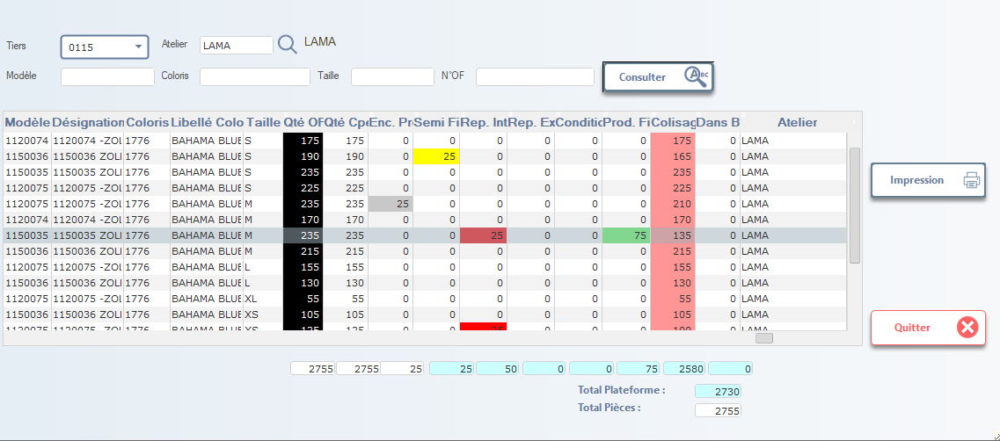

# Suivi des Packs de Stock — Préparation à l’Expédition

Cette fenêtre permet de **visualiser et suivre les produits finis en stock**, par modèle, coloris, taille et atelier. Elle est utilisée pour préparer les commandes clients, vérifier la disponibilité, et générer les documents d’expédition.

> ⚠️ **Remarque** : Ce module est central pour la logistique client. Il garantit que les produits expédiés correspondent exactement aux commandes et aux spécifications du client.

---

## 1. En-tête de recherche

### Tiers
- Sélectionnez le tiers client via la liste déroulante (ex: `0115` → `MEY GmbH`).
- Utilisez la loupe pour rechercher par nom ou code.

### Atelier
- Saisissez ou sélectionnez l’atelier source (ex: `LAMA`).
- Permet de filtrer les produits selon leur origine de production.

### Modèle / Coloris / Taille / N° OF
- Champs optionnels pour affiner la recherche :
  - **Modèle** : Référence produit (ex: `1120074`, `1150036`).
  - **Coloris** : Code couleur (ex: `BAHAMA BLUE S`).
  - **Taille** : Taille du produit (ex: `S`, `M`, `L`, `XL`).
  - **N° OF** : Numéro de l’ordre de fabrication (ex: `PO026311BE`).

> 💡 **Astuce** : Laissez vide pour afficher tous les produits disponibles pour ce tiers.

---

## 2. Tableau principal — Détails des produits en stock

Affiche les produits finis avec leurs quantités par statut :

| Colonne             | Description |
|---------------------|-------------|
| **Modèle**          | Référence technique du produit (ex: `1120074`). |
| **Désignation**     | Libellé complet (ex: `1120074 - ZOLI 1776`). |
| **Coloris**         | Code couleur (ex: `BAHAMA BLUE S`). |
| **Libellé Colo**    | Nom complet du coloris (ex: `BAHAMA BLUE S`). |
| **Taille**          | Taille du produit (ex: `S`, `M`, `L`, `XL`). |
| **Qté OF**          | Quantité produite dans l’OF. |
| **Qté Cpt.Enc.**    | Quantité encadrée (réservée pour une commande). |
| **Pr.Semi FiRep.**  | Quantité en attente de réparation semi-finie (ex: `25` en jaune). |
| **Int.Rep.**        | Quantité en réparation interne. |
| **ExCondit.**       | Quantité en conditionnement externe (ex: `0`). |
| **Prod. FiColisag** | Quantité prête à être colisée (en vert). |
| **Dans B**          | Quantité déjà dans un bon de livraison (ex: `175` en rouge). |
| **Atelier**         | Atelier source (ex: `LAMA`). |

> 📌 **Note** : Les couleurs indiquent le statut :
> - 🟢 **Vert** = Prêt à coliser.
> - 🟡 **Jaune** = En attente de réparation.
> - 🔴 **Rouge** = Déjà affecté à un BL (bon de livraison).

---

## 3. Statistiques globales

Affiche les totaux calculés automatiquement :

| Champ               | Valeur |
|---------------------|--------|
| **Total Plateforme** | `2730` → Quantité totale disponible sur la plateforme (tous statuts confondus). |
| **Total Pièces**     | `2755` → Quantité totale produite (incluant les pièces en réparation ou réservées). |

> ✅ **Utilité** : Ces chiffres aident à évaluer la disponibilité globale avant de valider une commande client.

---

## 4. Actions disponibles

| Bouton                | Icône | Fonction |
|-----------------------|-------|----------|
| **Consulter**         | 🔍    | Lance la recherche avec les filtres sélectionnés. |
| **Impression**        | 🖨️    | Imprime la liste des produits en stock (utile pour la préparation physique des colis). |
| **Quitter**           | ❌    | Ferme la fenêtre sans sauvegarder (aucune donnée n’est modifiée ici). |

> 💡 **Bonnes pratiques** :
> - Toujours consulter avant d’imprimer pour éviter les doublons.
> - Vérifiez que **Prod. FiColisag > 0** avant de créer un bon de livraison.
> - Si **Dans B > 0**, cela signifie que le produit est déjà attribué à une commande — ne pas le réutiliser.

---

## 5. Règles de gestion des stocks

- ✅ **Stock disponible** = `Prod. FiColisag` + `Qté OF – Qté Encadrée – Qté en Réparation`.
- ❗ **Ne pas expédier** un produit en **Pr.Semi FiRep.** ou **Int.Rep.** — il doit être réparé d’abord.
- 📦 **Colisage** : Seuls les produits en **Prod. FiColisag** peuvent être ajoutés à un carton.

> 🔄 **Cycle complet** :
> 1. Production → 2. Contrôle Qualité → 3. Stock Final → 4. Préparation Expédition → 5. Bon de Livraison → 6. Expédition.

---

## 6. Bonnes pratiques logistiques

- ✅ Toujours vérifier la **disponibilité par taille** avant de valider une commande.
- 📋 Conservez une copie imprimée pour le suivi physique en entrepôt.
- 👩‍💼 Communiquez avec le service commercial si un produit est indisponible — proposez un remplacement ou un délai.
- 📈 Utilisez les données pour anticiper les ruptures et ajuster les plans de production.

---

✅ Vous êtes maintenant capable de suivre précisément les produits finis en stock, de préparer les commandes clients, et de garantir une expédition fluide et sans erreur.
