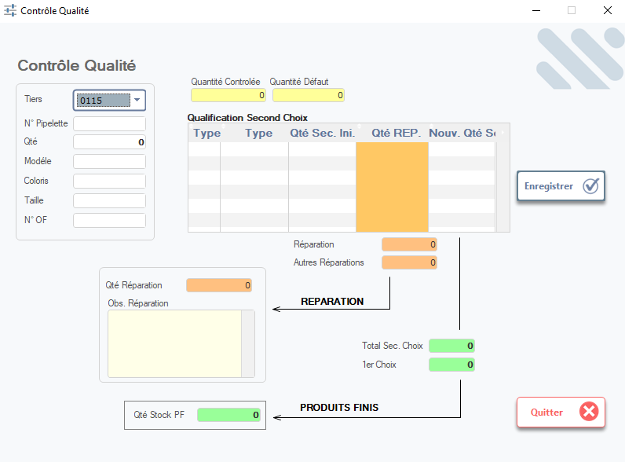

# Contrôle Qualité — Gestion des Packs de Production

Cette fenêtre permet de **qualifier les lots de production** après leur sortie de l’atelier (couture, montage, finition). Elle décide si les produits sont **acceptés en stock final (prêts à expédier)** ou s’ils doivent être **renvoyés en réparation** en cas de défaut.



> ⚠️ **Remarque** : Ce module est critique pour garantir la qualité client. Toute erreur ici peut entraîner des retours, des ruptures ou des coûts de reprise élevés.

---

## 1. En-tête du contrôle

### Tiers
- Sélectionnez le tiers client via la liste déroulante (ex: `0115` → `MEY GmbH`).
- Utilisez la loupe pour rechercher par nom ou code.

### N° Pipelette
- Numéro unique de la pipelette de contrôle qualité (généré automatiquement ou saisi manuellement).

### Qté
- Quantité totale contrôlée dans ce lot (ex: `0` = non encore saisie).

> 💡 **Astuce** : La quantité est souvent pré-remplie depuis le ticket de production ou le bon de livraison.

---

## 2. Informations produit

Saisissez ou recherchez les données liées au produit contrôlé :

| Champ             | Description |
|-------------------|-------------|
| **Modèle**        | Référence produit (ex: `APM001550C`). |
| **Coloris**       | Code couleur (ex: `PURPLE`, `NOIR`). |
| **Taille**        | Taille du produit (ex: `S`, `M`, `L`). |
| **N° OF**         | Numéro de l’ordre de fabrication (ex: `PO026311BE`). |

> 📌 **Note** : Ces champs permettent de tracer le produit jusqu’à l’OF et au client final.

---

## 3. Résultats du contrôle

Affiche les quantités contrôlées et défectueuses :

| Champ               | Description |
|---------------------|-------------|
| **Quantité Contrôlée** | Total des pièces inspectées (ex: `100`). |
| **Quantité Défaut**    | Nombre de pièces non conformes (ex: `5`). |

> ✅ **Validation** : Le système ne permet pas d’enregistrer un contrôle sans ces deux valeurs.

---

## 4. Qualification Second Choix

Zone réservée aux produits non conformes mais récupérables :

| Colonne              | Description |
|----------------------|-------------|
| **Type**             | Type de défaut (ex: `Tissu`, `Couture`, `Finition`). |
| **Qté Sec. Ini.**    | Quantité initiale classée en second choix. |
| **Qté REP.**         | Quantité à réparer. |
| **Nouv. Qté Stock**  | Quantité restante après réparation (si applicable). |

> 📊 **Utilité** : Permet de suivre les produits en attente de réparation ou de transformation.

---

## 5. Flux de décision — Réparation vs Produits Fins

Le système propose deux flux principaux :

### 🔴 **Réparation**
- Si des défauts sont détectés :
  - Saisissez la **Qté Réparation**.
  - Ajoutez une **Obs. Réparation** (ex: “défaut de surpiqûre”, “tache sur col”).
  - Les pièces sont renvoyées en atelier pour correction.

### 🟢 **Produits Fins (Stock PF)**
- Si aucune anomalie :
  - La **Qté Stock PF** est mise à jour automatiquement.
  - Les produits sont transférés en **stock final**, prêts à être expédiés au client.

> 🔄 **Flux visuel** :
> ```
> Contrôle → [Défaut ?] → OUI → Réparation
>                      → NON → Produits Fins (Stock Final)
> ```

---

## 6. Zones de saisie détaillée

### Qté Réparation
- Saisissez le nombre de pièces à réparer (ex: `3`).
- Ce champ est activé uniquement si **Quantité Défaut > 0**.

### Obs. Réparation
- Zone de texte libre pour décrire le défaut et les actions à mener.
- Exemples :
  - “Retoucher surpiqûre avant col”
  - “Remplacer bouton manquant”
  - “Repasser pli sur manche”

> ✍️ **Bonnes pratiques** :
> - Soyez précis dans les observations pour faciliter la réparation.
> - Ne laissez jamais cette zone vide si des pièces sont en réparation.

---

## 7. Actions disponibles

| Bouton                | Icône | Fonction |
|-----------------------|-------|----------|
| **Enregistrer**       | ✔️    | Sauvegarde le résultat du contrôle et met à jour le stock. |
| **Quitter**           | ❌    | Ferme la fenêtre sans sauvegarder (alerte si modifications non validées). |

> ✅ **Conseil** : Toujours vérifier que **Qté Contrôlée = Qté Stock PF + Qté Réparation + Qté Défaut** avant d’enregistrer.

---

## 8. Bonnes pratiques qualité

- ✅ **Contrôle 100 %** : Pour les clients exigeants, contrôlez chaque pièce.
- 📋 Conservez les pipelettes pour les audits qualité ou les réclamations clients.
- 👩‍🔧 Communiquez rapidement avec l’atelier de réparation pour éviter les retards.
- 📈 Utilisez les données de défaut pour identifier les tendances (ex: problème récurrent sur un modèle).

---

✅ Vous êtes maintenant capable de gérer efficacement le contrôle qualité des packs de production, en décidant s’ils vont en stock final ou en réparation — garantissant ainsi la satisfaction client et la maîtrise des coûts de reprise.
