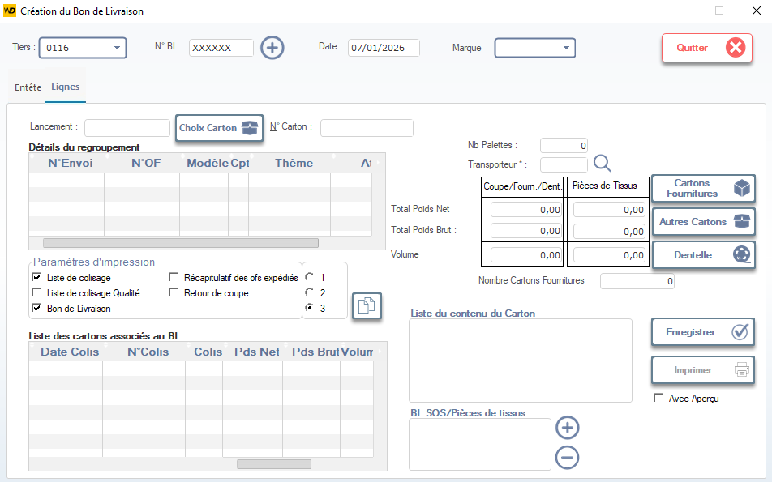

# Création du Bon de Livraison — Pièces Coupées

Cette fenêtre permet de générer un **Bon de Livraison (BL)** pour les pièces coupées destinées à l’atelier de montage (ex: Swing, Assemblage, Finition). Elle assure la traçabilité logistique entre la coupe et les ateliers de production, tout en préparant les données d’expédition interne ou externe.

> ⚠️ **Remarque** : Ce module est utilisé pour les transferts internes (coupe → atelier) ou externes (vers sous-traitants). Le BL n’est pas un document client final, mais un outil de gestion de flux.

---

## 1. En-tête du Bon de Livraison

### Tiers
- Sélectionnez le tiers destinataire via la liste déroulante (ex: `0116`).
- Utilisez l’icône loupe pour rechercher par nom ou code.

### N° BL
- Numéro unique du bon de livraison (généré automatiquement ou saisi manuellement, ex: `XXXXXX`).

### Date
- Date de création du BL (ex: `07/01/2026`).  
  > ✅ Par défaut, la date du jour est proposée.

### Marque
- Sélectionnez la marque cliente associée (ex: `MEY`, `ZARA`, `CALVIN KLEIN`) pour filtrer les modèles et OF.

---

## 2. Onglets principaux

- **Entête** → Informations générales du BL.
- **Lignes** → Détails des cartons et pièces incluses.

> 💡 **Conseil** : Les lignes sont alimentées automatiquement depuis les colisages validés.

---

## 3. Détails du regroupement

Affiche les éléments liés au regroupement logistique :

| Colonne         | Description |
|-----------------|-------------|
| **N° Envoi**    | Numéro d’envoi interne ou externe (si applicable). |
| **N° OF**       | Ordre de fabrication source (ex: `6034GRENAT`). |
| **Modèle Cpt**  | Modèle comptable ou de suivi (ex: `6034 - SG FOULARD`). |
| **Thème**       | Thème de production (ex: `HIVER 2026`). |
| **AI**          | Champ technique (ex: indicateur d’automatisation). |

> 📌 **Note** : Ces champs permettent de regrouper plusieurs OF ou colis dans un même BL.

---

## 4. Paramètres d’impression

Permet de choisir les documents à générer avec le BL :

- ✅ **Liste de colisage** → Liste des cartons inclus.
- ❌ **Liste de colisage Qualité** → À cocher si un contrôle qualité a été effectué.
- ✅ **Bon de Livraison** → Document principal à imprimer.

> 🔢 **Récapitulatif des OF expédiés** :
> - Optionnel : affiche un résumé des OF inclus dans le BL.
> - **Retour de coupe** : utile si des pièces sont retournées après inspection.

---

## 5. Informations logistiques

### Choix Carton
- Bouton permettant de sélectionner ou créer un carton à inclure dans le BL.

### N° Carton
- Saisissez ou scannez le numéro du carton à ajouter.

### Nb Palettes / Transporteur
- Nombre de palettes associées au BL.
- Sélectionnez le transporteur (interne ou externe) si expédition hors site.

---

## 6. Poids et Volume

Affiche les données logistiques du BL :

| Champ              | Description |
|--------------------|-------------|
| **Total Poids Net**   | Poids net des pièces coupées (sans emballage). |
| **Total Poids Brut**  | Poids brut (pièces + cartons + emballage). |
| **Volume**            | Volume total occupé (en m³). |

> 📦 **Utilité** : Ces données servent à la planification logistique et au calcul des frais de transport.

---

## 7. Liste du contenu du Carton

Zone dynamique affichant les cartons associés au BL :

| Colonne           | Description |
|-------------------|-------------|
| **Date Colis**    | Date de création du colis. |
| **N° Colis**      | Numéro unique du colis. |
| **Colis**         | Type de colis (ex: `CARTON FABRICATION`). |
| **Pds Net / Brut / Volume** | Données pondérales et volumétriques par carton. |

> ✅ **Validation** : Le BL ne peut être enregistré que si au moins un carton est associé.

---

## 8. BL SOS / Pièces de tissus

Zone réservée aux pièces spéciales ou urgentes :

- Permet d’ajouter manuellement des pièces de tissu ou des tickets non inclus dans les colisages standard.
- Utile pour les **urgences**, **retours**, ou **pièces de remplacement**.

> ➕ **Ajouter** : bouton pour insérer une nouvelle ligne.
> ➖ **Supprimer** : bouton pour retirer une ligne.

---

## 9. Actions disponibles

| Bouton                | Icône | Fonction |
|-----------------------|-------|----------|
| **Cartons Fournitures** | 📦    | Ajoute les cartons contenant des fournitures (aiguilles, fils, etc.). |
| **Autres Cartons**     | 📦➕   | Ajoute des cartons non classés (ex: accessoires, échantillons). |
| **Dentelle**           | 🧵    | Ajoute des cartons de dentelle (si applicable). |
| **Enregistrer**        | ✔️    | Sauvegarde le BL et le rend disponible pour l’impression. |
| **Imprimer**           | 🖨️    | Génère et imprime le Bon de Livraison (avec ou sans aperçu). |
| **Quitter**            | ❌    | Ferme la fenêtre sans sauvegarder (alerte si modifications non enregistrées). |

> ✅ **Bonnes pratiques** :
> - Toujours vérifier que **le poids et le volume** correspondent aux cartons physiques.
> - Imprimez le BL **avant** de fermer les cartons pour éviter les erreurs de chargement.
> - Pour les transferts internes, utilisez le transporteur **INTERNE** ou laissez vide.

---

## 10. Règles spécifiques aux pièces coupées

- Le BL doit refléter **exactement** ce qui est envoyé : aucun ticket ou pièce ne doit être oublié.
- En cas d’écart, annulez le BL et recréez-le après correction.
- Les pièces SOS doivent être clairement identifiées dans la zone dédiée pour éviter les confusions en atelier.

---

✅ Vous êtes maintenant capable de créer, valider et imprimer un Bon de Livraison pour les pièces coupées, en garantissant la traçabilité, la conformité logistique et la fluidité des flux vers les ateliers de production.
