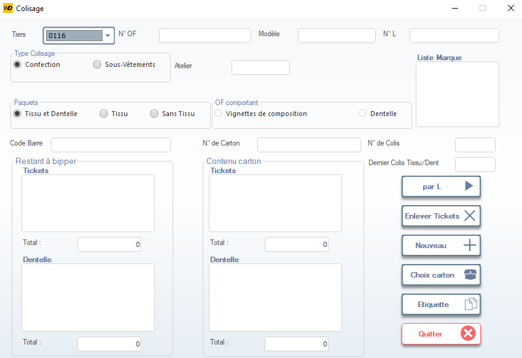

# Colisage Pièces Coupées – Atelier Swing

Cette fenêtre permet de gérer le colisage des pièces coupées issues de l’atelier de coupe, en vue de leur transfert vers l’atelier **Swing** (ex: surpiquage, assemblage, finition). Elle assure la traçabilité des tickets, la conformité du contenu du carton, et la préparation logistique avant expédition interne.

> ⚠️ **Remarque** : Ce module est utilisé exclusivement pour les flux internes entre la coupe et les ateliers de confection. Aucune expédition client n’est concernée ici.

---

## 1. En-tête de la fenêtre

### Tiers
- Sélectionnez le **tiers client** associé à la commande (ex: `0116` → `MEY GmbH`).
- Ce champ permet de filtrer les OF et modèles liés au client.

### N° OF / Modèle / N° L
- **N° OF** : Ordre de fabrication source (ex: `6034GRENAT`).
- **Modèle** : Référence produit (ex: `6034 - 6034`).
- **N° L** : Numéro de lancement (ex: `L02684`).

> 💡 Ces champs sont souvent pré-remplis automatiquement selon le contexte de production.

---

## 2. Type de Colisage

Pour ce flux, le type est toujours :

- ✅ **Confection** → Car il s’agit de pièces destinées à l’assemblage.
- **Atelier** : Doit être rempli avec **Swing** ou le code correspondant (ex: `SW`).

> 📌 **Important** : Le choix de l’atelier détermine la destination physique et les règles de contrôle qualité applicables.

---

## 3. Paquets

Dans le cadre du transfert vers **Swing**, le colis contient uniquement des **pièces coupées**, donc :

- ✅ **Sans Tissu** → Coché par défaut (car le tissu a déjà été coupé).
- Les options *Tissu* et *Tissu et Dentelle* ne sont **pas utilisées** ici.

> 🔍 **Explication** : « Sans Tissu » signifie que le colis ne contient pas de rouleaux ou de métrage brut, mais des pièces découpées prêtes à être cousues.

---

## 4. Gestion des Tickets

### Restant à biper
- Liste des **tickets de coupe** non encore scannés pour ce colis.
- Chaque ticket représente un lot de pièces identiques (ex: 10 devants, 10 dos…).
- Le système affiche le **total** des tickets restants.

### Contenu carton
- Affiche les **tickets déjà scannés** et inclus dans le carton en cours.
- Le total doit correspondre exactement au nombre attendu pour le modèle et la quantité de l’OF.

> ✅ **Validation** : Le colis ne peut être validé que si tous les tickets requis ont été scannés.

---

## 5. Informations techniques

### Code Barre
- Code-barres du carton (généré ou saisi manuellement).
- Utilisé pour le suivi via lecteur portable dans l’atelier.

### N° de Carton / N° de Colis
- Identifiants uniques pour la traçabilité interne.
- Le **N° de Colis** est souvent incrémenté automatiquement.

### Dernier Colis Tissu/Dent
- Informations historiques (non utilisées ici, car il s’agit de pièces coupées).

---

## 6. Liste Marque
Affiche la marque cliente associée (ex: `MEY`, `ZARA`, `CALVIN KLEIN`).  
Permet de vérifier que les pièces correspondent bien à la commande client.

---

## 7. Actions disponibles

| Bouton                | Icône | Fonction |
|-----------------------|-------|----------|
| **par L**             | ▶️    | Valide le colis et le rend disponible pour l’atelier **Swing**. |
| **Enlever Tickets**   | ❌    | Retire les tickets sélectionnés du carton (en cas d’erreur de scan). |
| **Nouveau**           | ➕    | Réinitialise la fiche pour créer un nouveau colis. |
| **Choix carton**      | 📦    | Permet de modifier les paramètres du carton (taille, type, etc.). |
| **Etiquette**         | 🏷️    | Imprime l’étiquette du carton avec code-barres, OF, modèle, et destination **Swing**. |
| **Quitter**           | ❌    | Ferme sans sauvegarder (alerte si modifications en cours). |

> ✅ **Bonnes pratiques** :
> - Toujours scanner **tous les tickets** avant validation.
> - Vérifier que le **modèle** et le **client** correspondent à ceux de l’OF.
> - Imprimer l’**étiquette** avant de fermer le carton.

---

## 8. Règles spécifiques à l’atelier Swing

- Les colis doivent être complets (aucun ticket manquant) : un colis partiel peut bloquer la chaîne de montage.
- Les erreurs de colisage génèrent des