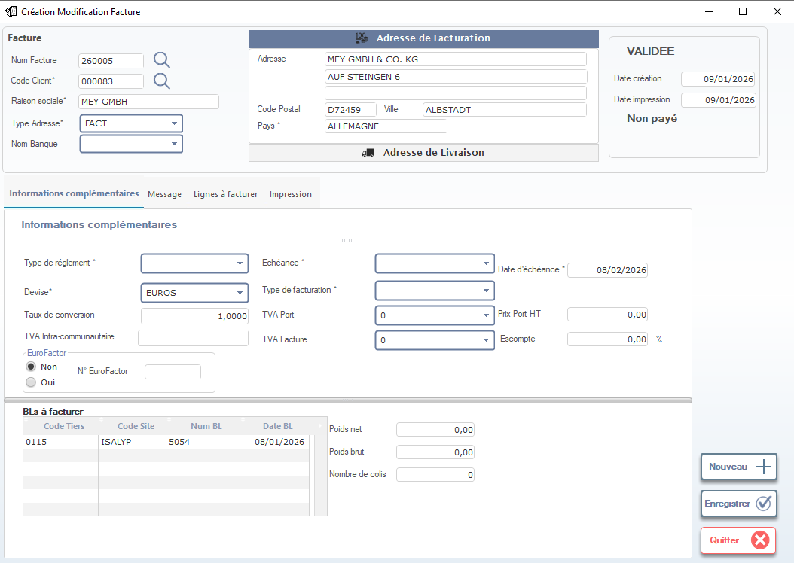

# Création / Modification Facture

Cette fenêtre permet de **créer ou modifier une facture client** à partir des bons de livraison (BL) validés. Elle est utilisée pour générer les documents de facturation, calculer les montants HT/TTC, et gérer les conditions de paiement et de livraison.

> ⚠️ **Remarque** : Cette facture est destinée au **client final** (ex: `MEY GMBH`). Une fois validée, elle ne peut plus être modifiée sans annulation explicite.

---

## 1. En-tête de la facture

### Numéro Facture
- Numéro unique de la facture (ex: `260005`).
- Généré automatiquement par le système ou saisi manuellement.

### Code Client*
- Sélectionnez le client via la liste déroulante (ex: `000083` → `MEY GMBH`).
- Utilisez la loupe pour rechercher par nom ou code.

### Raison sociale*
- Nom complet du client (ex: `MEY GMBH & CO. KG`).

### Type Adresse*
- Choisissez le type d’adresse :
  - ✅ **FACT** → Adresse de facturation (obligatoire).
  - 🟡 **LIVR** → Adresse de livraison (si différente).

### Nom Banque
- Sélectionnez la banque du client (si applicable pour les virements).

> 💡 **Astuce** : Les champs marqués d’un astérisque (`*`) sont obligatoires pour valider la facture.

---

## 2. Adresse de Facturation

Affiche les informations de facturation du client :

| Champ             | Valeur |
|-------------------|--------|
| **Adresse**       | `AUF STEINGEN 6` |
| **Code Postal**   | `D72459` |
| **Ville**         | `ALBSTADT` |
| **Pays**          | `ALLEMAGNE` |

> 📌 **Note** : Ces données sont pré-remplies depuis la fiche client. Modifiez-les uniquement si nécessaire.

---

## 3. Statut de la facture

Zone affichant les dates et le statut financier :

| Champ               | Valeur |
|---------------------|--------|
| **Date création**   | `09/01/2026` |
| **Date impression** | `09/01/2026` |
| **Statut**          | `Non payé` → Changera après règlement. |

> ✅ **Validation** : La facture est marquée **VALIDEE** dès qu’elle est enregistrée — elle est alors comptabilisée.

---

## 4. Informations complémentaires

### Type de règlement*
- Sélectionnez le mode de paiement (ex: `Virement`, `Chèque`, `Crédit`).

### Devise*
- Choisissez la devise de la facture (ex: `EUROS`).

### Taux de conversion
- Si devise étrangère, saisissez le taux de change (ex: `1,0000`).

### Échéance*
- Date limite de paiement (ex: `08/02/2026`).

### Type de facturation*
- Définissez le type de facture :
  - `Standard`
  - `Avoir`
  - `Facture Proforma`

> 📊 **Utilité** : Ces champs influencent le traitement comptable et les rapports financiers.

---

## 5. TVA et escompte

| Champ                     | Description |
|---------------------------|-------------|
| **TVA Port**              | Montant de la TVA sur les frais de port (ex: `0`). |
| **Prix Port HT**          | Frais de port hors taxe (ex: `0,00`). |
| **TVA Facture**           | Taux de TVA appliqué à la facture (ex: `0` = intra-communautaire). |
| **Escompte**              | Pourcentage d’escompte (ex: `0,00 %`). |

> 🔢 **Calcul automatique** :
> - Le système calcule le montant TTC en fonction de la TVA et des escomptes.
> - Vérifiez toujours que les totaux correspondent aux BL associés.

---

## 6. BLs à facturer

Tableau permettant de sélectionner les bons de livraison à inclure dans la facture :

| Colonne             | Description |
|---------------------|-------------|
| **Code Tiers**      | Code du client (ex: `0115`). |
| **Code Site**       | Site de production (ex: `ISALYP`). |
| **Num BL**          | Numéro du bon de livraison (ex: `5054`). |
| **Date BL**         | Date du BL (ex: `08/01/2026`). |

> ✅ **Bonnes pratiques** :
> - Toujours vérifier que les BL sélectionnés correspondent à la même commande client.
> - Ne pas facturer un BL non validé ou en attente de contrôle qualité.

---

## 7. Récapitulatif des poids et colis

Affiche les données logistiques liées aux BL :

| Champ             | Valeur |
|-------------------|--------|
| **Poids net**     | `0,00` |
| **Poids brut**    | `0,00` |
| **Nombre de colis** | `0` |

> 📦 **Utilité** : Ces données peuvent être imprimées sur la facture pour le suivi logistique.

---

## 8. Actions disponibles

| Bouton                | Icône | Fonction |
|-----------------------|-------|----------|
| **Nouveau**           | ➕    | Crée une nouvelle facture (réinitialise tous les champs). |
| **Enregistrer**       | ✔️    | Sauvegarde la facture et la rend disponible pour impression. |
| **Quitter**           | ❌    | Ferme la fenêtre sans sauvegarder (alerte si modifications non enregistrées). |

> ✅ **Conseil** : Toujours cliquer sur **Enregistrer** avant de quitter pour éviter toute perte de données.

---

## 9. Bonnes pratiques comptables

- ✅ Toujours vérifier que **le total de la facture** correspond à la somme des BL associés.
- 📋 Conservez une copie imprimée pour le suivi comptable et fiscal.
- 👩‍💼 Communiquez avec le service commercial si un BL doit être exclu de la facture (ex: retour client).
- 📈 Utilisez les rapports mensuels pour suivre les factures impayées et relancer les clients.

---

✅ Vous êtes maintenant capable de créer, valider et imprimer des factures clients de manière rigoureuse, en garantissant la conformité fiscale, la précision des montants, et la traçabilité des BL associés.
