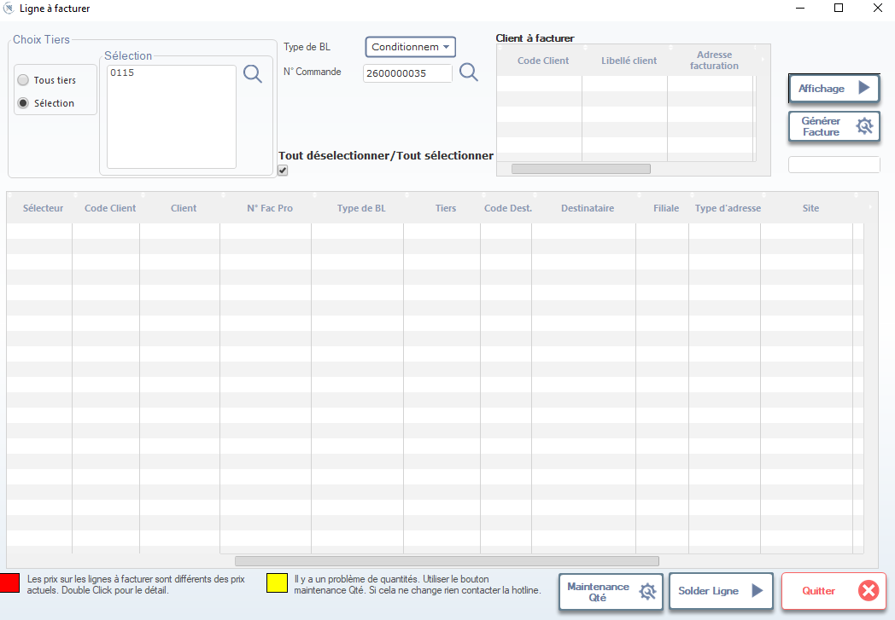

# Suivi Facturation — Lignes à Facturer (OF non payés par étape)

Cette fenêtre permet de **suivre les ordres de fabrication (OF) non encore facturés**, en affichant leur progression à travers les étapes clés de la chaîne de valeur : **coupe → swing (couture) → finition → stock final → expédition → facturation**. Elle est utilisée par les équipes commerciales, logistiques et financières pour identifier les blocages, anticiper les revenus, et relancer les retards.

> ⚠️ **Remarque** : Un OF non facturé ne signifie pas nécessairement un problème — il peut être en cours de production. Ce suivi permet de distinguer les OF normaux des OF bloqués ou en retard.

---

## 1. En-tête de recherche

### Choix Tiers
- ✅ **Sélection** → Filtrez les OF pour un tiers spécifique (ex: `0115`).
- 🟡 **Tous tiers** → Affiche tous les clients (utile pour un suivi global).

### Type de BL
- Sélectionnez le type de bon de livraison :
  - `Conditionnement`
  - `Fournitures`
  - `Dentelle`

> 💡 **Astuce** : Utilisez cette liste pour filtrer les OF selon leur nature logistique.

---

## 2. Numéro de Commande

- Saisissez ou recherchez un numéro de commande client (ex: `2600000035`).
- Permet de lier directement les OF à la commande commerciale.

> 🔍 **Fonctionnement** : Cliquez sur la loupe pour afficher les OF associés à cette commande.

---

## 3. Client à facturer

Affiche les clients potentiels pour la facturation :

| Colonne             | Description |
|---------------------|-------------|
| **Code Client**     | Code unique du client (ex: `0115`). |
| **Libellé client**  | Nom complet (ex: `MEY GMBH & CO. KG`). |
| **Adresse facturation** | Adresse de facturation (ex: `AUF STEINGEN 6, ALBSTADT`). |

> 📌 **Note** : Ces données sont pré-remplies depuis la fiche client. Modifiez-les uniquement si nécessaire.

---

## 4. Tableau principal — Lignes à facturer

Affiche les lignes (BLs) prêtes à être facturées, avec leurs détails :

| Colonne             | Description |
|---------------------|-------------|
| **Sélecteur**       | Case à cocher pour sélectionner la ligne à inclure dans la facture. |
| **Code Client**     | Code du client (ex: `0115`). |
| **Client**          | Nom du client. |
| **N° Fac Pro**      | Numéro de facture provisoire (si applicable). |
| **Type de BL**      | Type de bon de livraison (ex: `Conditionnement`). |
| **Tiers**           | Fournisseur ou site source (ex: `ISALYP`). |
| **Code Dest.**      | Code destination (ex: `LAMA`). |
| **Destinataire**    | Nom du destinataire (ex: `SWING`, `FINITION`). |
| **Filiale**         | Filiale ou département concerné. |
| **Type d’adresse**  | Type d’adresse (ex: `FACT`, `LIVR`). |
| **Site**            | Site de production (ex: `LAMA`). |

> ✅ **Validation** : Seules les lignes cochées seront incluses dans la facture générée.

---

## 5. Actions disponibles

| Bouton                | Icône | Fonction |
|-----------------------|-------|----------|
| **Affichage**         | ▶️    | Lance la recherche et affiche les lignes correspondantes. |
| **Générer Facture**   | ⚙️    | Crée une nouvelle facture à partir des lignes sélectionnées. |
| **Tout sélectionner / Tout désélectionner** | ☑️/☐ | Coche ou décoche toutes les lignes en un clic. |
| **Maintenance Qté**   | ⚙️    | Corrige les problèmes de quantités (ex: écart entre BL et stock). |
| **Solder Ligne**      | ▶️    | Marque la ligne comme soldée (utile pour les avoirs ou règlements partiels). |
| **Quitter**           | ❌    | Ferme la fenêtre sans sauvegarder (alerte si modifications non validées). |

> ✅ **Bonnes pratiques** :
> - Toujours cliquer sur **Affichage** avant de sélectionner les lignes.
> - Utilisez **Maintenance Qté** si vous voyez un message jaune en bas.
> - Ne générez une facture que si toutes les quantités sont correctes.

---

## 6. Messages d’alerte en bas de fenêtre

Le système affiche des alertes pour vous guider :

| Message             | Signification |
|---------------------|---------------|
| 🔴 **Les prix sur les lignes à facturer sont différents des prix actuels.** | Le prix unitaire a changé depuis la création du BL. Double-cliquez pour vérifier ou mettre à jour. |
| 🟡 **Il y a un problème de quantités. Utiliser le bouton Maintenance Qté.** | Les quantités en stock ou sur le BL ne correspondent pas. À corriger avant facturation. |
| ✅ **Pas d’alerte** | Tout est en ordre — vous pouvez générer la facture. |

> 💡 **Conseil** : Toujours résoudre les alertes avant de cliquer sur **Générer Facture**.

---

## 7. Bonnes pratiques de suivi

- ✅ **Suivi hebdomadaire** : Vérifiez chaque semaine les OF non facturés pour anticiper les retards.
- 📊 **Analyse par étape** : Identifiez si les blocages se situent en **coupe**, **swing** ou **finition**.
- 👩‍💼 **Relance commerciale** : Si un OF est bloqué depuis plus de 7 jours, contactez le service commercial ou l’atelier concerné.
- 📈 **Reporting** : Exportez les données pour créer un tableau de bord des OF en retard par client ou par modèle.

---

✅ Vous êtes maintenant capable de suivre précisément les OF non facturés, d’identifier les étapes bloquantes, et de générer des factures fiables — garantissant ainsi une trésorerie saine et une relation client optimale.
