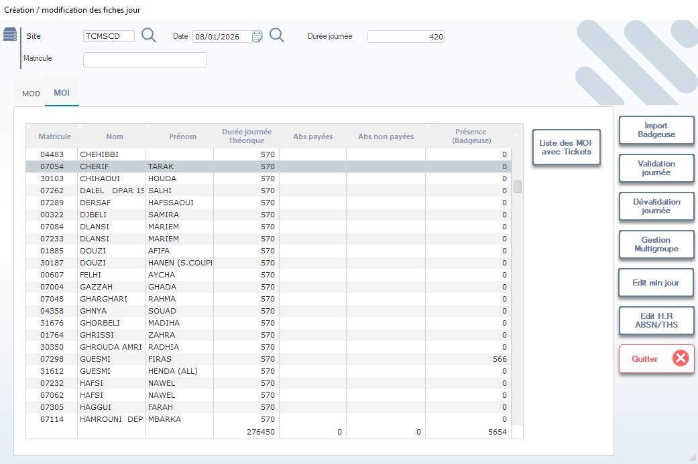

# Suivi Quotidien de la Production par Opératrice

Cette fenêtre permet de visualiser et gérer **la fiche de journée de chaque opératrice (« girl »)** dans l’atelier de couture. Elle affiche les heures théoriques, les absences, la présence via badgeuse, et sert de base au calcul de la productivité et de la rémunération à la pièce.

> ⚠️ **Remarque** : Cette fiche est mise à jour quotidiennement. Elle est utilisée pour le suivi RH, la paie, et l’analyse de performance des lignes de production.

---

## 1. En-tête de configuration

### Site
- Sélectionnez le site de production via la liste déroulante (ex: `TCMSCD`).

### Date
- Date de la journée à consulter ou modifier (ex: `08/01/2026`).
- Utilisez le calendrier pour naviguer facilement entre les jours.

### Durée journée
- Nombre de minutes théoriques travaillées dans la journée (ex: `420` = 7h).
- Ce champ peut être modifié selon les horaires spécifiques (turnover, jours fériés, etc.).

### Matricule
- Saisissez ou recherchez un matricule spécifique pour filtrer une opératrice.

> 💡 **Astuce** : Cliquez sur la loupe pour rechercher par nom ou prénom si vous ne connaissez pas le matricule.

---

## 2. Onglets principaux

- **MOD** → Données techniques ou historiques (moins utilisé ici).
- ✅ **MOI** → **Main d’œuvre individuelle** → Affiche les données quotidiennes par opératrice.

> 📌 **Note** : L’onglet **MOI** est l’onglet principal pour le suivi quotidien.

---

## 3. Tableau principal — Liste des opératrices

Affiche toutes les opératrices affectées au site pour la date sélectionnée :

| Colonne             | Description |
|---------------------|-------------|
| **Matricule**       | Identifiant unique de l’opératrice (ex: `04483`, `07054`). |
| **Nom**             | Nom de famille (ex: `CHEHIBBI`, `CHERIF`). |
| **Prénom**          | Prénom (ex: `TARAK`, `HOUDA`). |
| **Durée journée Théorique** | Temps de travail prévu (en minutes, ex: `570` = 9h30). |
| **Abs payées**      | Minutes d’absence rémunérées (ex: congé maladie, RTT). |
| **Abs non payées**  | Minutes d’absence non rémunérées (ex: absence injustifiée). |
| **Présence (Badgeuse)** | Heures effectivement enregistrées via badgeuse (ex: `0` = non présente, `566` = présent 9h26). |

> 📊 **Calcul automatique** :
> - **Heures réelles** = `Présence (Badgeuse)`
> - **Heures perdues** = `Durée journée Théorique – Présence`
> - **Productivité** = Calculée plus tard via les tickets scannés.

---

## 4. Actions disponibles

| Bouton                | Icône | Fonction |
|-----------------------|-------|----------|
| **Import Badgeuse**   | 📥    | Importe les données de présence depuis le système de badgeuse. |
| **Validation journée**| ✔️    | Valide les données de la journée pour la paie et le reporting. |
| **Dévalidation journée** | ❌   | Annule la validation (utile en cas d’erreur). |
| **Gestion Multigroupe** | 🔄   | Permet de gérer les opératrices affectées à plusieurs groupes/lignes. |
| **Edit min jour**     | ✏️    | Modifie manuellement la durée de la journée (ex: temps partiel). |
| **Edit H.R ABSN/THS** | 📝    | Édite les heures d’absence (payées ou non) pour ajustement RH. |
| **Liste des MOI avec Tickets** | 📋 | Affiche les tickets associés à chaque opératrice pour croiser avec la productivité. |
| **Quitter**           | ❌    | Ferme la fenêtre sans sauvegarder (alerte si modifications non validées). |

> ✅ **Bonnes pratiques** :
> - Toujours **importer les badges** avant toute validation.
> - Vérifiez que **Présence (Badgeuse)** > 0 pour les opératrices présentes.
> - Utilisez **Edit H.R ABSN/THS** pour corriger les erreurs de badgeuse (ex: oubli de pointage).

---

## 5. Cas particuliers

### Opératrice avec 0 présence
- Si `Présence (Badgeuse)` = 0 → l’opératrice n’a pas pointé.
- Vérifiez si elle était absente (remplir `Abs payées` ou `Abs non payées`) ou si c’est une erreur technique.

### Opératrice avec présence > durée théorique
- Ex: `Durée journée Théorique` = 570, `Présence` = 566 → OK.
- Ex: `Présence` = 600 → possible si heures supplémentaires ou erreur de badgeuse.

> 📌 **Important** : Une présence supérieure à la durée théorique doit être justifiée (heures supp., double poste…).

---

## 6. Intégration avec la productivité

Les données de cette fiche sont liées aux **tickets de production** :

- Chaque ticket scanné par une opératrice est associé à son **matricule**.
- Le système calcule :
  - **Nombre de pièces produites** par opératrice.
  - **Temps moyen par pièce**.
  - **Rendement en %** (quantité produite / temps disponible).

> 📈 **Utilité** : Ce tableau sert de base pour :
> - La paie à la pièce.
> - Les primes de performance.
> - L’ajustement des charges de travail par ligne.

---

## 7. Bonnes pratiques RH & Production

- ✅ **Validation quotidienne** : Faites valider la journée avant 10h le lendemain pour ne pas retarder la paie.
- 📁 Conservez les fiches journalières pour les audits ou les contrôles sociaux.
- 👩‍🏭 Communiquez avec les chefs d’équipe si une opératrice a une faible présence ou productivité récurrente.
- 🔄 Utilisez **Gestion Multigroupe** si une opératrice travaille sur plusieurs lignes dans la même journée.

---

✅ Vous êtes maintenant capable de suivre, valider et analyser la production quotidienne par opératrice, en garantissant la précision des données pour la paie, la productivité et la gestion des ressources humaines.
