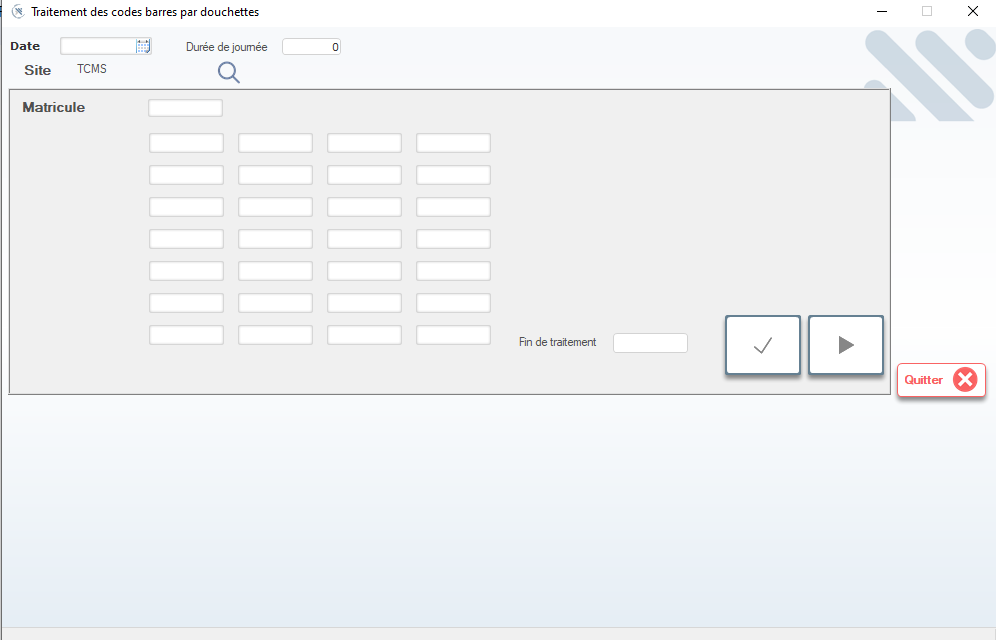

# Traitement des Codes Barres par Douchettes

Cette fenêtre permet de **scannner les tickets de production** via des douchettes (lecteurs de code-barres) en atelier. Elle est utilisée quotidiennement par les chefs d’équipe ou les opératrices pour enregistrer le début et la fin des opérations, et ainsi mesurer la productivité en temps réel.

> ⚠️ **Remarque** : Ce module est conçu pour une utilisation rapide et intuitive sur le terrain. Il ne nécessite pas de saisie manuelle — tout se fait par scan.

---

## 1. En-tête de configuration

### Date
- Sélectionnez la date de la journée à traiter (ex: `08/01/2026`).
- Par défaut, la date du jour est proposée.

### Site
- Affiche le site de production (ex: `TCMS`) — non modifiable ici.
- Utilisez la loupe pour changer de site si nécessaire.

### Durée de journée
- Nombre de minutes théoriques travaillées (ex: `0` = non défini → à remplir selon les horaires).

> 💡 **Astuce** : Cette valeur est souvent pré-remplie automatiquement selon le planning ou la fiche MOI.

---

## 2. Zone de scan — Matricule & Tickets

La zone centrale est dédiée au **scan des codes-barres** :

- **Matricule** : Champ où scanner le matricule de l’opératrice (ex: `07054`, `30103`).
- **Grille de scan** : 6 lignes × 4 colonnes = 24 emplacements pour scannner les tickets de production.

> 📌 **Fonctionnement** :
> - Scannez d’abord le **matricule** de l’opératrice.
> - Puis scannez les **tickets de production** associés à son travail (ex: `25C12CAR2`, `PO026311BE`).
> - Le système enregistre automatiquement :
>   - Qui a scanné ?
>   - Quand ?
>   - Quel ticket ?
>   - Début ou fin d’opération ?

---

## 3. Actions disponibles

| Bouton                | Icône | Fonction |
|-----------------------|-------|----------|
| **Fin de traitement** | ✅    | Valide et sauvegarde tous les scans effectués pendant la session. |
| **▶️ Exécuter / Suivant** | ▶️ | Passe à la prochaine étape ou lance le traitement des données scannées. |
| **Quitter**           | ❌    | Ferme la fenêtre sans sauvegarder (alerte si scans non validés). |

> ✅ **Bonnes pratiques** :
> - Toujours cliquer sur **Fin de traitement** après avoir terminé les scans.
> - Ne pas quitter sans valider — sinon les données sont perdues.
> - Si une erreur de scan survient, utilisez le bouton **▶️ Suivant** pour corriger ou ignorer.

---

## 4. Rôle dans le suivi de production

Ce module est **la clé du suivi en temps réel** :

- 🔢 **Identifie chaque opératrice** via son matricule.
- 🏷️ **Associe chaque ticket** à une opération spécifique (montage, conditionnement…).
- ⏱️ **Mesure le temps passé** par opération → permet de calculer :
  - La productivité (pièces/heure).
  - Le rendement individuel.
  - Les goulets d’étranglement.

> 📈 **Exemple** : Une opératrice scanne son matricule, puis le ticket `25C12CAR2`. À la fin de la série, elle rescanne le même ticket → le système calcule le temps passé et la quantité produite.

---

## 5. Bonnes pratiques en atelier

- ✅ **Scanner dès le début** : Chaque opératrice doit scanner son ticket avant de commencer.
- ❗ **Ne pas sauter d’étape** : Si un ticket n’est pas scanné, il ne sera pas comptabilisé dans la productivité.
- 📋 Conserver une copie papier des tickets en cas de panne de douchette.
- 👩‍🏭 Former les opératrices à utiliser correctement les douchettes — éviter les doublons ou erreurs de scan.

---

## 6. Intégration avec les autres modules

Les données scannées sont automatiquement liées à :

- **Fiche Jour MOI** → pour le suivi RH et la paie.
- **Planning des Lignes de Couture** → pour ajuster les charges de travail.
- **Réimpression des Tickets** → pour recréer un ticket perdu ou endommagé.

> 🔄 **Cycle complet** :
> 1. Génération du ticket → 2. Scan en atelier → 3. Calcul de productivité → 4. Validation paie → 5. Reporting.

---

✅ Vous êtes maintenant capable d’utiliser efficacement le module de scan des codes-barres pour suivre la production en temps réel, garantissant une traçabilité précise et une rémunération juste pour chaque opératrice.
