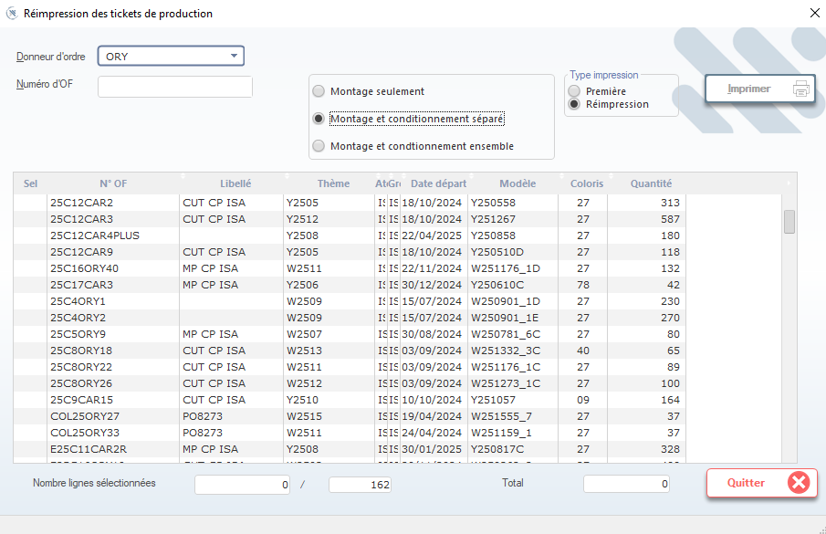

# Réimpression des Tickets de Production

Cette fenêtre permet de **réimprimer les tickets de production** associés à des ordres de fabrication (OF). Ces tickets sont utilisés en atelier de couture pour identifier chaque lot de pièces, suivre la productivité des opératrices (« girls ») et calculer les temps de montage par modèle.

> ⚠️ **Remarque** : Les tickets imprimés doivent être scannés ou saisis manuellement lors du démarrage et de la fin de chaque opération. Ils sont indispensables pour le suivi de la productivité et la rémunération à la pièce.

---

## 1. En-tête de recherche

### Donneur d’ordre
- Sélectionnez le donneur d’ordre via la liste déroulante (ex: `ORY`).
- Ce champ filtre les OF selon le client ou le fournisseur.

### Numéro d’OF
- Saisissez ou recherchez un numéro d’ordre de fabrication spécifique (ex: `PO026311BE`).

> 💡 **Astuce** : Laissez vide pour afficher tous les OF liés au donneur d’ordre sélectionné.

---

## 2. Type d’impression

Choisissez le type de ticket à imprimer :

- ✅ **Montage seulement** → Ticket pour les opérations de montage uniquement.
- 🟢 **Montage et conditionnement séparé** → Tickets distincts pour montage et conditionnement (le plus courant).
- 🔹 **Montage et conditionnement ensemble** → Un seul ticket pour les deux étapes.

> 📌 **Note** : Le choix dépend du processus de production en atelier. La plupart des usines utilisent **« Montage et conditionnement séparé »** pour une traçabilité fine.

---

## 3. Type d’impression (mode)

Définissez si vous imprimez :

- ❌ **Première impression** → Pour un ticket jamais imprimé auparavant.
- ✅ **Réimpression** → Pour remplacer un ticket perdu, endommagé ou non scanné.

> ✅ **Bonnes pratiques** :
> - Toujours cocher **Réimpression** si le ticket a déjà été généré.
> - Ne pas utiliser **Première impression** pour éviter les doublons dans le système.

---

## 4. Tableau principal — Liste des OF sélectionnables

Affiche les ordres de fabrication disponibles pour réimpression :

| Colonne             | Description |
|---------------------|-------------|
| **Sel**             | Case à cocher pour sélectionner l’OF à imprimer. |
| **N° OF**           | Numéro unique de l’ordre de fabrication (ex: `25C12CAR2`). |
| **Libellé**         | Libellé technique du ticket (ex: `CUT CP ISA`). |
| **Thème**           | Thème de production (ex: `Y2505`, `W2511`). |
| **AtbGn**           | Attribut générique (ex: `I:IS` = interne, `IS:IS` = sous-traitant). |
| **Date départ**     | Date de début prévue de la production. |
| **Modèle**          | Référence produit (ex: `Y250558`, `W251176_1D`). |
| **Coloris**         | Code couleur (ex: `27`, `78`, `09`). |
| **Quantité**        | Nombre de pièces à produire pour cet OF. |

> 📊 **Utilité** : Le nombre total de lignes sélectionnées et la quantité globale sont affichés en bas pour vérifier la cohérence avant impression.

---

## 5. Actions disponibles

| Bouton                | Icône | Fonction |
|-----------------------|-------|----------|
| **Imprimer**          | 🖨️    | Génère et imprime les tickets sélectionnés. |
| **Quitter**           | ❌    | Ferme la fenêtre sans imprimer. |

> ✅ **Conseil** : Toujours vérifier que **la quantité** correspond bien au besoin de production avant d’imprimer.

---

## 6. Rôle des tickets en atelier

Les tickets de production servent à :

- 🔢 **Identifier chaque lot de pièces** (modèle, coloris, quantité).
- 👩‍🏭 **Suivre la productivité des opératrices** (« girls ») : chaque ticket est associé à une opératrice ou une équipe.
- ⏱️ **Mesurer les temps de production** : le système calcule le temps passé par opération grâce aux scans des tickets.
- 📈 **Générer des rapports de performance** : productivité, rendement, taux d’absentéisme, etc.

> 🧾 **Exemple** : Une opératrice scanne son ticket en début de journée, puis à chaque fin de série. Le système enregistre le temps et la quantité produite.

---

## 7. Bonnes pratiques

- ✅ Toujours imprimer les tickets **avant le démarrage de la production**.
- ❗ Ne jamais réimprimer un ticket sans raison : cela peut fausser les statistiques de productivité.
- 📋 Conserver une copie papier des tickets imprimés pour le cas où les scanners tombent en panne.
- 🔄 Si un ticket est perdu, annulez-le dans le système et réimprimez-le avec la même référence (en mode **Réimpression**).

---

✅ Vous êtes maintenant capable de réimprimer les tickets de production de manière fiable, en garantissant leur utilisation correcte pour le suivi de la productivité et des temps de production en atelier de couture.
