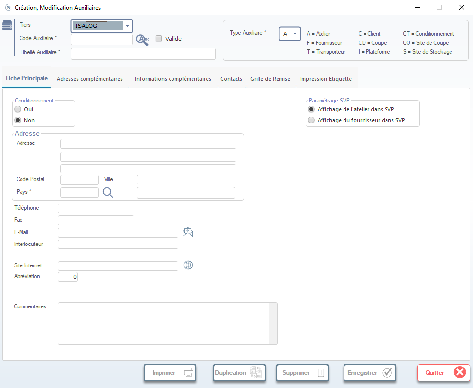

# Création et Modification des Auxiliaires

Cette fenêtre permet de créer ou modifier les fiches auxiliaires (fournisseurs, clients, ateliers, etc.) dans le système. Elle est accessible depuis le menu principal ou via une recherche préalable.

> ⚠️ **Remarque** : Assurez-vous d’avoir les droits appropriés pour créer ou modifier des auxiliaires.

---

## 1. En-tête de la fiche

### Tiers
- **Sélectionnez un tiers existant** dans la liste déroulante (ex: `ISALOG`).  
- Utilisez l’icône loupe pour rechercher un tiers par nom ou code.
- Cochez la case **Valide** si le tiers doit être actif dans le système.

### Type Auxiliaire
- Sélectionnez le type d’auxiliaire dans la liste déroulante :
  - **A** = Atelier
  - **C** = Client
  - **F** = Fournisseur
  - **T** = Transporteur
  - **CD** = Coupe
  - **I** = Plateforme
  - **CT** = Conditionnement
  - **CO** = Site de Coupe
  - **S** = Site de Stockage

> ✅ Le type sélectionné influence les champs disponibles et les règles métier appliquées.

---

## 2. Onglets principaux

La fiche contient plusieurs onglets pour organiser les informations :

- **Fiche Principale** → Informations de base (adresse, contact, paramètres)
- **Adresses complémentaires** → Ajout d’adresses secondaires
- **Informations complémentaires** → Données spécifiques au type d’auxiliaire
- **Contacts** → Gestion des contacts liés à l’auxiliaire
- **Grille de Remise** → Paramétrage des remises applicables
- **Impression Etiquette** → Configuration de l’étiquetage

---

## 3. Fiche Principale — Détails

### Conditionnement
- Choisissez entre :
  - **Oui** : L’auxiliaire gère des conditionnements.
  - **Non** : Pas de gestion de conditionnement (par défaut).

### Adresse
- **Adresse** : Saisissez l’adresse complète sur plusieurs lignes.
- **Code Postal / Ville / Pays** : Renseignez ces champs. Utilisez la loupe à côté du champ "Pays" pour rechercher un pays dans la liste.
- **Téléphone / Fax / E-Mail** : Coordonnées de contact.
  - L’icône courrier 📧 à côté de l’email permet d’envoyer un message directement.
- **Interlocuteur** : Nom du contact principal.
- **Site Internet** : URL du site web (avec icône globe 🌐 pour ouvrir le lien).
- **Abréviation** : Code court utilisé dans les listes ou exports (ex: `0` par défaut).

### Paramétrage SVP
- Configurez l’affichage de cet auxiliaire dans le module SVP (Suivi des Ventes/Produits) :
  - **Affichage de l’atelier dans SVP** → Active l’affichage si c’est un atelier.
  - **Affichage du fournisseur dans SVP** → Active l’affichage si c’est un fournisseur.

> 🔄 Ces options sont mutuellement exclusives selon le type d’auxiliaire sélectionné.

---

## 4. Commentaires

Un champ libre **Commentaires** est disponible en bas de la fiche pour ajouter des notes internes ou des remarques contextuelles.

---

## 5. Actions en bas de fenêtre

Les boutons situés en bas permettent d’interagir avec la fiche :

| Bouton | Icône | Fonction |
|--------|-------|----------|
| **Imprimer** | 🖨️ | Imprime la fiche actuelle. |
| **Duplication** | 📄+📄 | Crée une copie de la fiche (utile pour créer un nouveau tiers similaire). |
| **Supprimer** | 🗑️ | Supprime définitivement la fiche (confirmation requise). |
| **Enregistrer** | ✔️ | Sauvegarde toutes les modifications apportées. |
| **Quitter** | ❌ | Ferme la fenêtre sans sauvegarder (si des modifications non sauvegardées existent, une alerte apparaît). |

> 💡 **Conseil** : Toujours cliquer sur **Enregistrer** avant de quitter pour éviter toute perte de données.

---

## 6. Règles de saisie

- Les champs marqués d’un astérisque (`*`) sont obligatoires.
- La validation des données se fait automatiquement lors de l’enregistrement.
- Si un champ est invalide, un message d’erreur s’affiche et le champ est mis en évidence.

---

## 7. Astuces & Bonnes Pratiques

- Utilisez la duplication pour créer des tiers similaires (ex: plusieurs sites d’un même client).
- Vérifiez toujours le **Type Auxiliaire** avant de valider, car il impacte fortement le comportement du système.
- Pour les fournisseurs, activez l’option “Affichage du fournisseur dans SVP” si vous souhaitez les voir dans les tableaux de bord SVP.

---

✅ Vous êtes maintenant prêt(e) à créer ou modifier des auxiliaires efficacement !
