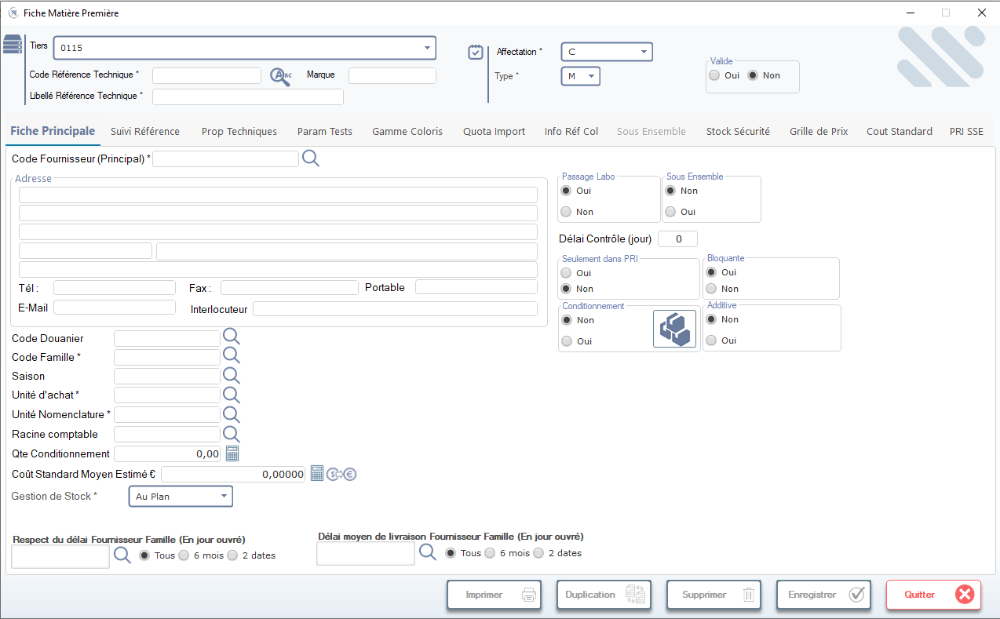

# Fiche Matière Première

Cette fiche permet de créer ou modifier les références des matières premières dans le système. Elle est utilisée pour gérer les données techniques, logistiques et financières liées aux matières premières fournies par les tiers.

> ⚠️ **Remarque** : Seuls les utilisateurs ayant les droits appropriés peuvent créer ou modifier une matière première.

---

## 1. En-tête de la fiche

### Tiers
- Sélectionnez le **tiers fournisseur principal** via la liste déroulante (ex: `0115`).
- Utilisez l’icône loupe pour rechercher un tiers par nom ou code.

### Affectation & Type
- **Affectation \*** : Détermine le type d’affectation (ex: `C` = Client, `F` = Fournisseur, etc.). Ce champ influence les règles métier.
- **Type \*** : Spécifie le type technique de la matière (ex: `M` = Matière première). Ce champ est obligatoire.

### Valide
- Cochez **Oui** pour activer la matière première dans le système.
- Cochez **Non** pour la désactiver sans la supprimer.

---

## 2. Onglets principaux

La fiche contient plusieurs onglets pour organiser les informations :

- **Fiche Principale** → Informations de base (fournisseur, adresse, paramètres)
- **Suivi Référence** → Historique et traçabilité
- **Prop Techniques** → Propriétés physico-chimiques
- **Param Tests** → Paramètres d’analyse qualité
- **Gamme Coloris** → Gestion des coloris associés
- **Quota Import** → Quotas d’importation
- **Info Réf Col** → Informations sur les références couleur
- **Sous Ensemble** → Composants ou sous-ensembles
- **Stock Sécurité** → Niveaux de stock de sécurité
- **Grille de Prix** → Tarifs fournisseurs
- **Cout Standard** → Coût standard de production
- **PRI SSE** → Paramètres relatifs au PRI/SSE

---

## 3. Fiche Principale — Détails

### Code Fournisseur (Principal) \*
- Saisissez ou recherchez le code du fournisseur principal via la loupe.

### Adresse
- Saisissez l’adresse complète du fournisseur sur plusieurs lignes.

### Contacts
- **Tél / Fax / Portable** : Numéros de contact.
- **E-Mail** : Adresse email du contact.
- **Interlocuteur** : Nom du responsable commercial ou technique.

### Codes et Unités
- **Code Douanier** : Code douanier international (utilisé pour les importations).
- **Code Famille \*** : Catégorie technique de la matière (obligatoire).
- **Saison** : Période d’utilisation ou de disponibilité.
- **Unité d’achat \*** : Unité dans laquelle la matière est achetée (obligatoire).
- **Unité Nomenclature \*** : Unité utilisée dans les nomenclatures de production (obligatoire).
- **Racine comptable** : Compte comptable associé à cette matière.

### Quantités & Coûts
- **Qte Conditionnement** : Quantité par conditionnement (ex: 0,00).
- **Coût Standard Moyen Estimé €** : Coût estimé unitaire (modifiable via les icônes calculatrice ou euro).

### Gestion de Stock \*
- Sélectionnez la méthode de gestion du stock :
  - **Au Plan** : Gestion planifiée (par défaut)
  - Autres options possibles selon le système

---

## 4. Paramètres techniques (à droite)

### Passage Labo
- **Oui** : La matière doit passer par le laboratoire avant validation.
- **Non** : Pas de passage obligatoire (par défaut).

### Sous Ensemble
- **Oui** : La matière fait partie d’un sous-ensemble.
- **Non** : Matière autonome (par défaut).

### Délai Contrôle (jour)
- Nombre de jours entre réception et contrôle qualité (ex: `0` = immédiat).

### Seulement dans PRI
- **Oui** : Disponible uniquement dans le module PRI.
- **Non** : Disponible partout (par défaut).

### Bloquante
- **Oui** : Bloque le processus si non contrôlée.
- **Non** : Ne bloque pas (par défaut).

### Conditionnement
- **Oui** : La matière est conditionnée (avec icône de cartons).
- **Non** : Matière brute (par défaut).

### Additive
- **Oui** : La matière est additive (ex: additif chimique).
- **Non** : Matière principale (par défaut).

---

## 5. Délais de livraison

### Respect du délai Fournisseur Famille (En jour ouvré)
- Permet de définir la tolérance de retard :
  - **Tous** : Pas de limite
  - **6 mois** : Tolérance de 6 mois
  - **2 dates** : À définir manuellement (via la loupe)

### Délai moyen de livraison Fournisseur Famille (En jour ouvré)
- Définissez le délai moyen de livraison :
  - **Tous** : Pas de délai fixe
  - **6 mois / 2 dates** : Options similaires au champ précédent

---

## 6. Actions en bas de fenêtre

Les boutons situés en bas permettent d’interagir avec la fiche :

| Bouton | Icône | Fonction |
|--------|-------|----------|
| **Imprimer** | 🖨️ | Imprime la fiche actuelle. |
| **Duplication** | 📄+📄 | Crée une copie de la fiche (utile pour créer une matière similaire). |
| **Supprimer** | 🗑️ | Supprime définitivement la fiche (confirmation requise). |
| **Enregistrer** | ✔️ | Sauvegarde toutes les modifications apportées. |
| **Quitter** | ❌ | Ferme la fenêtre sans sauvegarder (alerte si modifications non sauvegardées). |

> 💡 **Conseil** : Toujours cliquer sur **Enregistrer** avant de quitter pour éviter toute perte de données.

---

## 7. Règles de saisie

- Les champs marqués d’un astérisque (`*`) sont **obligatoires**.
- La validation des données se fait automatiquement lors de l’enregistrement.
- Si un champ est invalide, un message d’erreur s’affiche et le champ est mis en évidence.

---

## 8. Astuces & Bonnes Pratiques

- Utilisez la duplication pour créer des matières similaires (ex: variantes de couleur ou de fournisseur).
- Vérifiez toujours les **unités d’achat** et **nomenclature** : elles doivent être cohérentes avec les autres modules (production, stocks).
- Pour les matières critiques, activez **Passage Labo** et **Bloquante** pour garantir la qualité.
- Le **Coût Standard Moyen Estimé** doit être régulièrement mis à jour pour refléter les coûts réels.

---

✅ Vous êtes maintenant prêt(e) à gérer efficacement les fiches matières premières !
