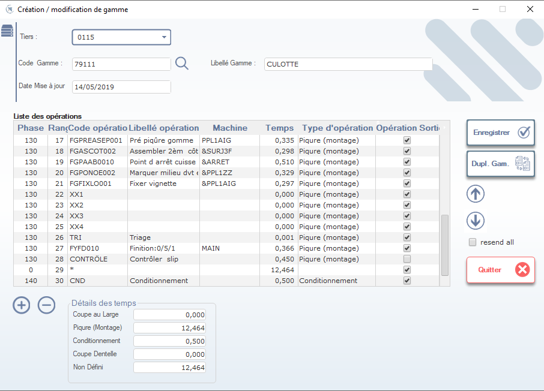

# 📋 Documentation : Fiche « Création / modification de gamme »

> **Date d'actualisation** : mercredi 7 janvier 2026  
> **Objectif** : Permet de créer ou modifier une **gamme opératoire** (ou gamme de fabrication) associée à un produit ou composant. Elle définit les étapes de production, les machines utilisées, les temps opératoires et les points de contrôle qualité.

> ⚠️ **Remarque** : Seuls les utilisateurs ayant les droits **Gamme** ou **Production** peuvent accéder à cette fiche.

---

## 1. En-tête de la fiche

### Tiers
- Sélectionnez le **tiers principal** (ex: `0115`) via la liste déroulante.
- Utilisez l’icône loupe pour rechercher un tiers par nom ou code.

### Code Gamme \*
- Saisissez ou recherchez le **code unique de la gamme** (ex: `79111`).
- Ce champ est **obligatoire** et doit être unique dans le système.

### Libellé Gamme
- Saisissez un libellé descriptif (ex: `CULOTTE`).
- Utile pour identifier rapidement la gamme dans les listes ou rapports.

### Date Mise à jour
- Affiche automatiquement la date de dernière modification.
- Non modifiable manuellement — mis à jour lors de l’enregistrement.

---

## 2. Liste des opérations

Tableau principal qui détaille chaque étape de la gamme.

| Colonne              | Description                                                                 |
|----------------------|-----------------------------------------------------------------------------|
| **Phase**            | Numéro de phase (ex: `130`, `140`). Regroupe les opérations logiques.       |
| **Rang**             | Ordre séquentiel de l’opération dans la phase.                              |
| **Code opératoire**  | Code interne de l’opération (ex: `FGPREASEP001`).                           |
| **Libellé opération**| Description textuelle de l’opération (ex: "Pré piqure gomme").               |
| **Machine**          | Machine ou poste utilisé (ex: `&PPL1AIG`, `&SURJ3F`).                       |
| **Temps**            | Durée de l’opération en heures (ex: `0,335`).                               |
| **Type d’opération** | Type fonctionnel (ex: "Piqure (montage)", "Conditionnement").                |
| **Opération Sortie** | Case à cocher si l’opération génère une sortie ou un point de contrôle.     |

> ✅ **Astuce** : Les lignes avec `*` dans la colonne "Rang" sont des opérations génériques ou non spécifiques au produit.

---

## 3. Boutons d’ajout/suppression d’opérations (en bas à gauche)

| Icône | Fonction                                                                 |
|-------|--------------------------------------------------------------------------|
| **+** | Ajoute une nouvelle ligne d’opération à la fin de la liste.                |
| **–** | Supprime la ligne sélectionnée (demande confirmation).                     |

> 💡 **Conseil** : Toujours vérifier que la suppression d’une opération n’affecte pas les flux de production ou les temps cumulés.

---

## 4. Détails des temps (en bas à gauche)

Affiche le récapitulatif des temps cumulés par type d’opération :

- **Coupe au Large** : Temps de découpe (ex: `0,000`)
- **Piqure (Montage)** : Temps total de montage (ex: `12,464`)
- **Conditionnement** : Temps de conditionnement final (ex: `0,500`)
- **Coupe Dentelle** : Si applicable (ex: `0,000`)
- **Non Défini** : Temps non catégorisés (ex: `12,464`)

> 💡 Ces valeurs sont calculées automatiquement à partir des temps saisis dans la liste des opérations.

---

## 5. Boutons d’action (à droite)

| Bouton           | Icône | Fonction                                                                 |
|------------------|-------|--------------------------------------------------------------------------|
| **Enregistrer**  | ✔️    | Sauvegarde toutes les modifications apportées à la gamme.                 |
| **Dupl. Gam.**   | 📄+📄 | Crée une copie de la gamme actuelle (utile pour variantes ou produits similaires). |
| **↑ / ↓**        | ↑↓    | Permet de réordonner les opérations dans la liste.                        |
| **resend all**   | ☑️    | Réinitialise ou réenvoie tous les paramètres (fonction avancée, rarement utilisée). |
| **Quitter**      | ❌    | Ferme la fenêtre sans sauvegarder (alerte si modifications non sauvegardées). |

> 💡 **Conseil** : Toujours cliquer sur **Enregistrer** avant de quitter pour éviter toute perte de données.

---

## 6. Règles de saisie

- Les champs marqués d’un astérisque (`*`) sont **obligatoires**.
- La validation se fait automatiquement lors de l’enregistrement.
- Si un champ est invalide (ex: code doublon, temps négatif), un message d’erreur s’affiche et le champ est mis en évidence.

---

## 7. Astuces & Bonnes Pratiques (2026)

- Utilisez **Dupl. Gam.** pour créer des gammes similaires (ex: variantes de taille ou couleur).
- Vérifiez toujours que les **machines** et **temps** sont cohérents avec les capacités réelles de l’atelier.
- Pour les produits critiques, ajoutez des **opérations de contrôle qualité** (ex: "CONTROLE", "Contrôler slip") avec la case "Opération Sortie" cochée.
- Mettez à jour régulièrement les **temps opératoires** pour refléter les améliorations de productivité ou changements de process.
- Utilisez les boutons **+** et **–** pour ajuster dynamiquement la gamme selon les besoins de production.

---

✅ Vous êtes maintenant prêt(e) à créer, modifier et optimiser efficacement les gammes de production !