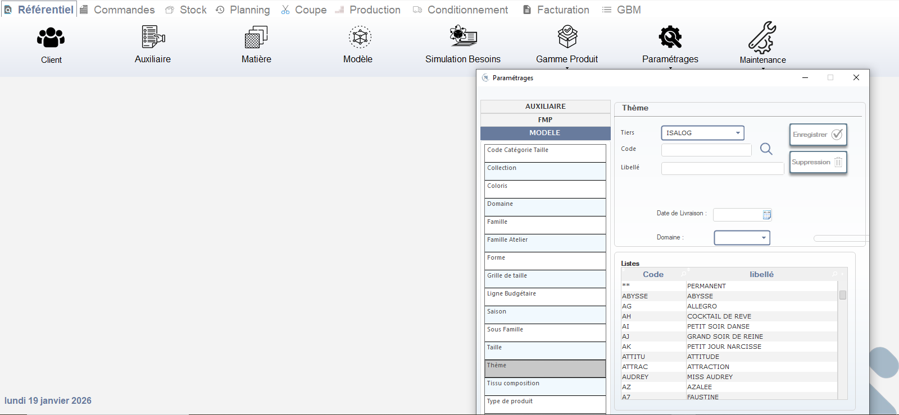

# Paramétrages — Gestion des données de référence (Saison, Thème, Collection, etc.)

Cette fenêtre permet de **créer ou modifier les paramètres manquants** dans le référentiel du système, tels que les **saisons**, **thèmes**, **collections**, **familles**, **tailles**, etc. Elle est utilisée par les administrateurs ou les responsables métiers pour enrichir le référentiel lors de la création de nouvelles références produits ou matières premières.

> ⚠️ **Remarque** : Seuls les utilisateurs ayant les droits d’administration peuvent créer ou supprimer des paramètres. Une erreur ici peut impacter plusieurs modules (production, planning, facturation).

---

## 1. Accès au module

### Menu principal
- Cliquez sur **Paramétrages** dans la barre de navigation principale.
- Le module s’ouvre dans une fenêtre modale avec deux panneaux :
  - **Panneau gauche** → Liste des types de paramètres.
  - **Panneau droit** → Formulaire de saisie et liste des valeurs existantes.

> 📌 **Note** : Ce module est accessible depuis n’importe quel écran via le menu `Paramétrages`.

---

## 2. Panneau gauche — Types de paramètres

Liste des catégories de données à gérer :

| Catégorie             | Description |
|-----------------------|-------------|
| **Code Catégorie Taille** | Codes techniques pour les tailles (ex: `S`, `M`, `L`). |
| **Collection**        | Collections saisonnières (ex: `HIVER 2026`, `ETE 2026`). |
| **Coloris**           | Codes couleur disponibles. |
| **Domaine**           | Domaine produit (ex: `FEMME`, `HOMME`, `ENFANT`). |
| **Famille**           | Famille technique (ex: `T-SHIRT`, `PANTALON`). |
| **Famille Atelier**   | Ateliers de production (ex: `SWING`, `FINITION`). |
| **Forme**             | Forme du produit (ex: `A`, `H`, `X`). |
| **Grille de taille**  | Grilles de tailles associées aux modèles. |
| **Ligne Budgétaire**  | Lignes budgétaires pour le suivi financier. |
| **Saison**            | Saisons commerciales (ex: `AW25`, `SS26`). |
| **Sous Famille**      | Sous-catégories de famille (ex: `T-SHIRT MANCHE COURTE`). |
| **Taille**            | Tailles physiques (ex: `34`, `36`, `38`). |
| **Thème**             | Thèmes de collection (ex: `COCKTAIL DE REVE`, `GRAND SOIR DE REINE`). |
| **Tissu composition** | Compositions textiles (ex: `100% COTON`, `POLYESTER 70%`). |
| **Type de produit**   | Type commercial (ex: `BASIQUE`, `NOUVEAUTÉ`). |

> ✅ **Bonnes pratiques** :
> - Toujours vérifier si le paramètre existe déjà avant de le créer.
> - Utilisez les codes courts et standards (ex: `AH` pour `COCKTAIL DE REVE`) pour faciliter les recherches.

---

## 3. Panneau droit — Formulaire de saisie (ex: Thème)

Affiche les champs à remplir pour créer un nouveau paramètre :

### Tiers
- Sélectionnez le tiers concerné (ex: `ISALOG`).
- Utile si le paramètre est spécifique à un fournisseur ou client.

### Code*
- Saisissez un code unique (ex: `AH`, `AI`, `AJ`).
- Obligatoire pour l’identification dans le système.

### Libellé*
- Saisissez le libellé complet (ex: `COCKTAIL DE REVE`).
- Obligatoire pour la lisibilité utilisateur.

### Date de Livraison
- Date de disponibilité du thème (ex: `01/09/2025`).
- Utile pour le planning de production.

### Domaine
- Sélectionnez le domaine associé (ex: `FEMME`, `HOMME`).

> 💡 **Astuce** : Les champs marqués d’un astérisque (`*`) sont obligatoires.

---

## 4. Liste des valeurs existantes

Affiche les paramètres déjà créés :

| Code  | Libellé              |
|-------|----------------------|
| `**`  | PERMANENT            |
| `ABYSSE` | ABYSSE             |
| `AG`  | ALLEGRO              |
| `AH`  | COCKTAIL DE REVE     |
| `AI`  | PETIT SOIR DANSE     |
| `AJ`  | GRAND SOIR DE REINE  |
| `AK`  | PETIT JOUR NARCISSE  |
| `ATTITU` | ATTITUDE          |
| `ATTRAC` | ATTRACTION        |
| `AUDREY` | MISS AUDREY       |
| `AZ`  | AZALEE               |
| `A7`  | FAUSTINE             |

> 📊 **Utilité** : Permet de voir rapidement les codes déjà utilisés et d’éviter les doublons.

---

## 5. Actions disponibles

| Bouton                | Icône | Fonction |
|-----------------------|-------|----------|
| **Enregistrer**       | ✔️    | Sauvegarde le nouveau paramètre ou les modifications. |
| **Suppression**       | 🗑️    | Supprime le paramètre sélectionné (confirmation requise). |
| **Quitter**           | ❌    | Ferme la fenêtre sans sauvegarder. |

> ✅ **Conseil** : Toujours cliquer sur **Enregistrer** après chaque création ou modification.

---

## 6. Bonnes pratiques de gestion du référentiel

- ✅ **Créer avant d’utiliser** : Ne créez jamais une référence produit sans avoir d’abord créé les paramètres nécessaires (saison, thème, collection…).
- 📋 Conservez une fiche de référence des codes utilisés pour éviter les erreurs.
- 👩‍💼 Communiquez avec les équipes produit et planning avant de supprimer un paramètre — cela peut casser des liens dans les OF ou les modèles.
- 🔄 Utilisez les codes standards pour faciliter l’intégration avec les autres modules (ex: ERP, PLM).

---

✅ Vous êtes maintenant capable de créer, modifier et supprimer les paramètres manquants dans le référentiel, en garantissant la cohérence des données entre tous les modules du système.
